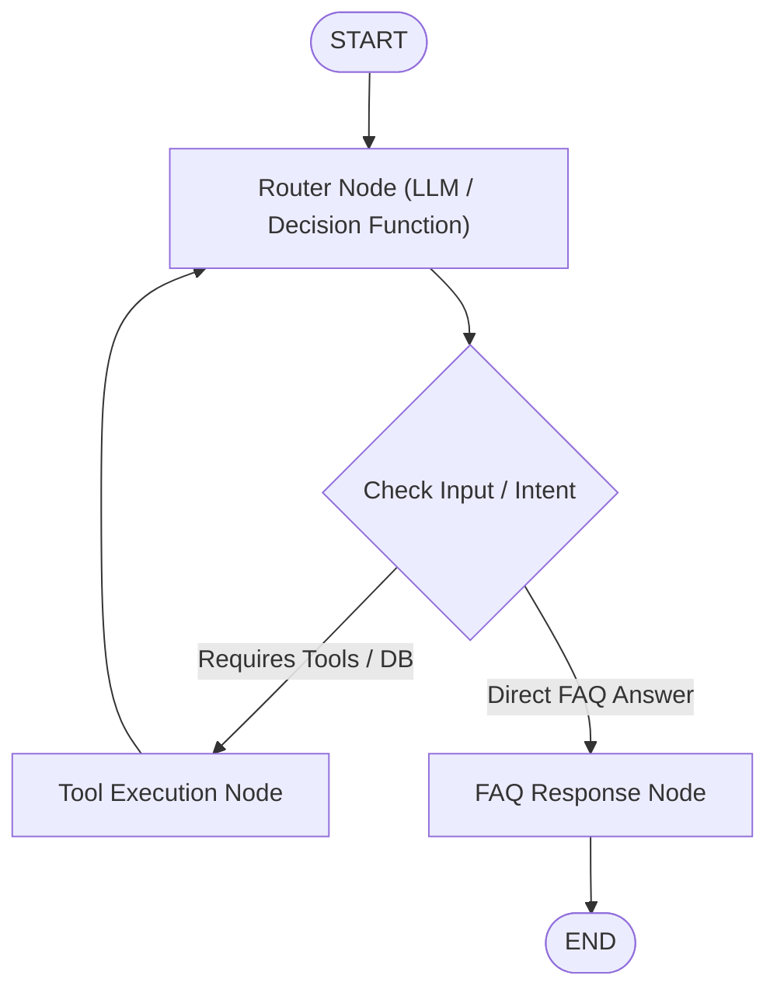
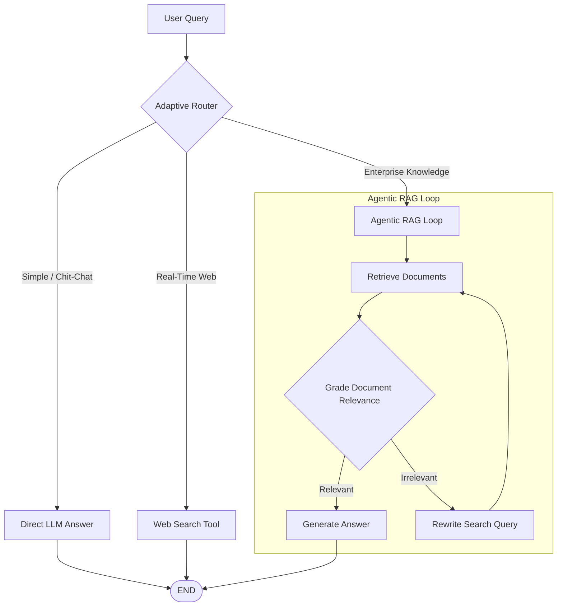
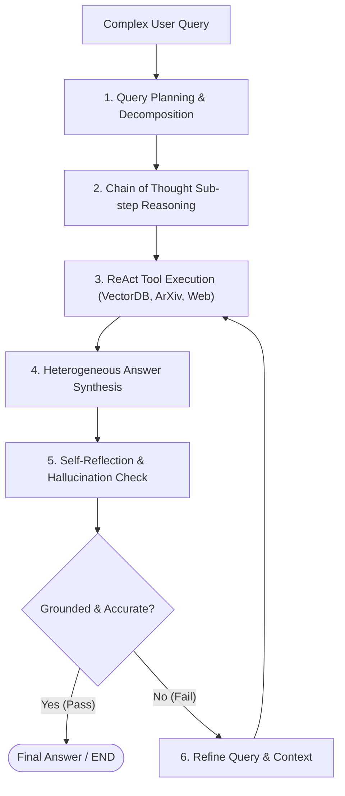

# 🦜🕸️ LangGraph, Agent Architectures & Autonomous RAG — Master Interview & Technical Reference

A comprehensive, production-grade study guide and fast-recall reference for **LangGraph primitives**, **ReAct agent loops**, **state management**, **streaming**, and **advanced RAG paradigms** (Traditional, Agentic, Adaptive, and Autonomous RAG).

---

## 📑 Master Quick Navigation

| Module | Core Topic | Key Interview Concepts |
| :--- | :--- | :--- |
| **[Module 1: LangGraph Primitives & State Architecture](#1-langgraph-primitives--state-architecture)** | Core Graph Primitives | State, Nodes, Edges, State Separation (`Input`/`Output`/`Overall`/`Private`), `.compile()` |
| **[Module 2: State Reducers, Chat History & Memory](#2-state-reducers-chat-history--checkpointer-memory)** | State Persistence | Default Overwrite vs Reducers (`add_messages`), `MemorySaver`, Thread Isolation (`thread_id`) |
| **[Module 3: Router Pattern & Dynamic Branching](#3-router-pattern--dynamic-branching)** | Conditional Routing | Static Workflows vs Dynamic Agents, `tools_condition`, Path Maps |
| **[Module 4: ReAct Agent Architecture & Tool Binding](#4-react-agent-architecture--tool-binding)** | Autonomous Reasoning | ReAct Loop ($\text{Act} \rightarrow \text{Observe} \rightarrow \text{Reason}$), `bind_tools`, `ToolNode`, Message Trace |
| **[Module 5: Streaming Modes & Token Event Handling](#5-streaming-modes--token-event-handling)** | Runtime Observability | `stream_mode="updates"` vs `values`, Asynchronous Token Streaming (`astream_events`) |
| **[Module 6: Foundational RAG Paradigms](#6-foundational-rag-paradigms-traditional-agentic--adaptive)** | Retrieval Paradigms | Traditional (1-Pass) vs Agentic vs Adaptive RAG, Document Grading, Query Rewriting |
| **[Module 7: Autonomous RAG, Query Planning & Reflection](#7-autonomous-rag-query-planning--reflection-loops)** | Fully Autonomous Systems | CoT vs Query Planning, Self-Reflection Loops, Multi-Source Synthesis, Full LangGraph Flow |
| **[Master Interview Q&A Cheatsheet](#8-master-interview-qa-cheatsheet)** | High-Frequency Questions | 10+ core interview questions with bulletproof 3-point responses |
| **[Repository Notebook Directory Index](#9-repository-notebook-directory-index)** | Source Code Mapping | Map of all 13 `.ipynb` notebook files in this repository |

---

## 1. LangGraph Primitives & State Architecture

### 💡 Core Mental Model & Theory for Interviews
* **The Shared Clipboard Analogy:** LangGraph models agentic workflows as stateful multi-actor graphs. Specialist workers (**Nodes**) take turns reading from and writing to a central shared clipboard (**State**), navigating along supervisor paths (**Edges**).
* **Cyclic Graphs vs. Linear DAGs:** Traditional chains (e.g., standard LangChain LCEL) only run forward once. LangGraph natively supports **cycles and loops**, enabling agents to reason, execute tools, observe outputs, self-correct errors, and retry.
* **The 3 Pillars:**
  1. **State:** Central Python data structure (`TypedDict`, `@dataclass`, or `BaseModel`) holding global application memory.
  2. **Nodes:** Python functions (`state -> dict`) executing logic and returning state updates.
  3. **Edges:** Directives controlling transitions (`add_edge` for fixed, `add_conditional_edges` for dynamic).
* **Compilation (`.compile()`):** Validates graph topology (detecting orphaned nodes or invalid edges) and transforms the graph builder into an executable `CompiledGraph` supporting `.invoke()`, `.stream()`, and checkpointer persistence.

---

### 📊 State Schema Comparison Matrix

| Feature | `TypedDict` | `@dataclass` | `Pydantic BaseModel` |
| :--- | :--- | :--- | :--- |
| **Field Access** | `state["key"]` | `state.key` | `state.key` |
| **Runtime Validation** | ❌ None | ❌ None | ✅ Strict runtime type checking |
| **Type Coercion** | ❌ No | ❌ No | ✅ Automatic (`"25"` $\rightarrow$ `25`) |
| **Field Constraints** | ❌ No | ❌ No | ✅ `Field(ge=0, regex=...)` |
| **Recommended Use** | Quick prototyping & basic chat | Clean OOP state structures | Production APIs & user inputs |

---

<details>
<summary><b>🌐 Real-World Example: E-Commerce Order Processing Pipeline</b></summary>

In an enterprise order fulfillment system, raw user requests (`InputState`) are validated and passed into an internal processing pipeline (`OverallState`). Intermediate calculations like shipping taxes are kept private (`PrivateState`), while only the final invoice status is returned to the user (`OutputState`). This prevents internal API keys or temporary calculations from leaking into external API responses.
</details>

<details>
<summary><b>💻 Basic Code Implementation: Multi-Schema State Management</b></summary>

```python
from typing import TypedDict
from langgraph.graph import StateGraph, START, END

# 1. Input Schema (exposed to callers)
class InputState(TypedDict):
    user_input: str

# 2. Output Schema (filtered response returned to callers)
class OutputState(TypedDict):
    graph_output: str

# 3. Overall Shared State (global memory)
class OverallState(TypedDict):
    user_input: str
    processed_text: str
    graph_output: str

# 4. Worker Nodes
def node_1(state: InputState) -> dict:
    return {"processed_text": state["user_input"].upper()}

def node_2(state: OverallState) -> dict:
    return {"graph_output": f"SUCCESS: {state['processed_text']}"}

# 5. Build Graph with Schema Separation
builder = StateGraph(OverallState, input_schema=InputState, output_schema=OutputState)
builder.add_node("node_1", node_1)
builder.add_node("node_2", node_2)

builder.add_edge(START, "node_1")
builder.add_edge("node_1", "node_2")
builder.add_edge("node_2", END)

graph = builder.compile()
# Output contains ONLY 'graph_output', hiding 'processed_text'
res = graph.invoke({"user_input": "process order #123"})
print(res)  # {'graph_output': 'SUCCESS: PROCESS ORDER #123'}
```
</details>

---

## 2. State Reducers, Chat History & Checkpointer Memory

### 💡 Core Mental Model & Theory for Interviews
* **Default State Overwrite:** By default, returning a dictionary from a node **completely replaces** that key's previous value in state.
* **Why Reducers are Required:** In conversational chatbots, returning `{"messages": [new_reply]}` without a reducer **erases all previous conversation history**. A reducer instructs LangGraph how to merge new updates into existing state.
* **`Annotated[list, add_messages]`:** Built-in reducer that **appends** new messages to the list (and updates existing messages if their `id` matches).
* **Standalone `add_messages()` vs. Graph Reducer:** Calling `add_messages(l1, l2)` in pure Python simply appends lists. Inside `StateGraph`, the schema annotation (`messages: Annotated[list, add_messages]`) signals the LangGraph runtime to apply the append operation automatically upon state updates.
* **Short-Term Memory (`MemorySaver`):** Passing a checkpointer to `.compile(checkpointer=memory)` saves graph state after every step. Sessions are isolated using `thread_id` inside `config={"configurable": {"thread_id": "1"}}`.

---

<details>
<summary><b>🌐 Real-World Example: Multi-Turn Customer Support Chatbot</b></summary>

A banking support chatbot needs to remember the user's account number mentioned in message 1 when the user asks "What is my balance?" in message 3. By attaching an `add_messages` reducer and configuring `MemorySaver` with `thread_id="user_session_99"`, the agent maintains conversation context seamlessly across separate user interactions.
</details>

<details>
<summary><b>💻 Basic Code Implementation: Chatbot with Reducer & Memory</b></summary>

```python
from typing import Annotated, TypedDict
from langchain_core.messages import AnyMessage, HumanMessage, AIMessage
from langgraph.graph import StateGraph, START, END
from langgraph.graph.message import add_messages
from langgraph.checkpoint.memory import MemorySaver

# 1. State Schema with add_messages Reducer
class ChatState(TypedDict):
    messages: Annotated[list[AnyMessage], add_messages]

# 2. Bot Node
def chatbot_node(state: ChatState) -> dict:
    # Simulating LLM response based on history
    last_msg = state["messages"][-1].content
    reply = f"Echoing: {last_msg}"
    return {"messages": [AIMessage(content=reply)]}

# 3. Build & Compile with MemorySaver
builder = StateGraph(ChatState)
builder.add_node("bot", chatbot_node)
builder.add_edge(START, "bot")
builder.add_edge("bot", END)

memory = MemorySaver()
graph = builder.compile(checkpointer=memory)

# 4. Execution across session threads
config = {"configurable": {"thread_id": "session-1"}}
r1 = graph.invoke({"messages": [HumanMessage(content="Hi, I am Krish")]}, config)
r2 = graph.invoke({"messages": [HumanMessage(content="What is my name?")]}, config)

print(f"Total messages in history: {len(r2['messages'])}")  # 4 messages preserved!
```
</details>

---

## 3. Router Pattern & Dynamic Branching

### 💡 Core Mental Model & Theory for Interviews
* **Static Workflows vs. Dynamic Agent Graphs:**
  - *Static Workflows:* Pre-programmed, hardcoded sequential node paths ($A \rightarrow B \rightarrow C$).
  - *Dynamic Agent Graphs:* The LLM acts as the decision-maker ("Brain"), evaluating user intent and dynamically choosing which tool or branch to execute.
* **`tools_condition` Built-in Router:** Inspects the latest message in `state["messages"]`. If the `AIMessage` contains `tool_calls`, it routes to the `"tools"` node; otherwise, it routes to `END`.
* **Path Mapping:** Custom dictionary passed into `builder.add_conditional_edges("src", router_fn, {"path_key": "target_node"})` to map router string outputs to specific custom node names.



---

<details>
<summary><b>🌐 Real-World Example: Intelligent Helpdesk Ticket Router</b></summary>

An IT helpdesk system receives incoming tickets. The router LLM classifies the ticket: if it requires database access (e.g., checking password reset eligibility), it routes to a `DatabaseTool` node; if it is a general inquiry, it routes to a `KnowledgeBase` node; if urgent, it escalates directly to a `HumanAgent` node.
</details>

<details>
<summary><b>💻 Basic Code Implementation: Conditional Router with Path Mapping</b></summary>

```python
from typing import TypedDict, Literal
from langgraph.graph import StateGraph, START, END

class RouterState(TypedDict):
    query: str
    category: str
    response: str

# 1. Router Decision Function
def route_query(state: RouterState) -> Literal["billing", "technical"]:
    if "refund" in state["query"].lower() or "pay" in state["query"].lower():
        return "billing"
    return "technical"

# 2. Branch Nodes
def billing_node(state: RouterState) -> dict:
    return {"response": "Routing to Billing Department..."}

def technical_node(state: RouterState) -> dict:
    return {"response": "Routing to Technical Support..."}

# 3. Assemble Graph
builder = StateGraph(RouterState)
builder.add_node("billing", billing_node)
builder.add_node("technical", technical_node)

builder.add_conditional_edges(
    START,
    route_query,
    {"billing": "billing", "technical": "technical"}
)
builder.add_edge("billing", END)
builder.add_edge("technical", END)

graph = builder.compile()
print(graph.invoke({"query": "I need a refund for my last invoice"}))
```
</details>

---

## 4. ReAct Agent Architecture & Tool Binding

### 💡 Core Mental Model & Theory for Interviews
* **The ReAct Paradigm:** ReAct combines **Reasoning** and **Acting** in an iterative loop:

$$\mathbf{Act} \longrightarrow \mathbf{Observe} \longrightarrow \mathbf{Reason}$$

1. **Act:** LLM evaluates the prompt and generates a structured tool invocation request (`AIMessage(tool_calls=[...])`).
2. **Observe:** The graph executes the requested tool and appends the result as a `ToolMessage`.
3. **Reason:** The LLM reads the `ToolMessage` observation and decides whether to call another tool or generate a final text answer.
* **Tool Binding (`llm.bind_tools`):** Attaches tool function signatures and docstrings as JSON schemas to the model. The model relies on clean function docstrings to determine *when* and *how* to call tools.
* **Anatomy of a Tool-Calling History:**
  1. `HumanMessage`: "What is 15 * 8?"
  2. `AIMessage`: `tool_calls=[{'name': 'multiply', 'args': {'a': 15, 'b': 8}, 'id': 'call_1'}]`
  3. `ToolMessage`: `content='120', tool_call_id='call_1'`
  4. `AIMessage`: "15 multiplied by 8 is 120."

---

<details>
<summary><b>🌐 Real-World Example: Automated Financial Analyst Agent</b></summary>

A financial analyst requests a report: "Search for Apple's 2024 revenue, add it to Microsoft's 2024 revenue, and calculate the average." The ReAct agent calls `CompanyRevenueSearch("Apple")`, receives the result, calls `CompanyRevenueSearch("Microsoft")`, receives the result, calls `Calculator(add)` and `Calculator(divide)`, and finally synthesizes a comprehensive financial summary.
</details>

<details>
<summary><b>💻 Basic Code Implementation: Complete ReAct Agent Loop</b></summary>

```python
from typing import Annotated, TypedDict
from langchain_core.messages import AnyMessage, HumanMessage
from langchain_core.tools import tool
from langchain_groq import ChatGroq
from langgraph.graph import StateGraph, START, END
from langgraph.graph.message import add_messages
from langgraph.prebuilt import ToolNode, tools_condition

# 1. Define Tool
@tool
def multiply(a: int, b: int) -> int:
    """Multiply two integers a and b."""
    return a * b

tools = [multiply]

# 2. Bind Tools to Model
llm = ChatGroq(model="qwen-qwq-32b")
llm_with_tools = llm.bind_tools(tools)

# 3. State & Node Definitions
class AgentState(TypedDict):
    messages: Annotated[list[AnyMessage], add_messages]

def agent_node(state: AgentState) -> dict:
    return {"messages": [llm_with_tools.invoke(state["messages"])]}

# 4. Graph Construction
builder = StateGraph(AgentState)
builder.add_node("agent", agent_node)
builder.add_node("tools", ToolNode(tools))

builder.add_edge(START, "agent")
builder.add_conditional_edges("agent", tools_condition)
builder.add_edge("tools", "agent")  # Loop back!

graph = builder.compile()
```
</details>

---

## 5. Streaming Modes & Token Event Handling

### 💡 Core Mental Model & Theory for Interviews
* **Why Streaming Matters:** LLM outputs and multi-step agent reasoning can take several seconds. Streaming gives real-time feedback to users.
* **Synchronous Graph Streaming Modes:**
  - `stream_mode="updates"`: Emits *only* the state delta/diff produced by each node as it finishes.
  - `stream_mode="values"`: Emits the *full consolidated state snapshot* after every node execution.
* **Asynchronous Token-Level Streaming (`astream_events`):** Streams granular tokens as the LLM generates them *inside* nodes, alongside metadata (`event`, `name`, `data`, `langgraph_node`).

---

### 📊 Streaming Modes Comparison Matrix

| API Method | Stream Mode | What It Emits | Ideal Use Case |
| :--- | :--- | :--- | :--- |
| `graph.stream()` | `"updates"` | Node output dictionary deltas (`{'node_a': {'key': 'val'}}`) | Progress bars, step loggers |
| `graph.stream()` | `"values"` | Full graph state dictionary snapshot | UI state tree sync |
| `graph.astream_events()` | `version="v2"` | Real-time token chunks (`on_chat_model_stream`) & event metadata | ChatGPT-style typewriter output |

---

<details>
<summary><b>🌐 Real-World Example: Real-Time Interactive AI Assistant UI</b></summary>

In a web application like ChatGPT, `astream_events` streams LLM text token-by-token directly to the frontend WebSocket so the user sees text immediately. Concurrently, `stream_mode="updates"` notifies the UI whenever a background tool (e.g., `ToolNode("web_search")`) starts or completes execution.
</details>

<details>
<summary><b>💻 Basic Code Implementation: State & Token Streaming Snippets</b></summary>

```python
# 1. Synchronous State Updates Mode
for chunk in graph.stream({"messages": [HumanMessage(content="Hi")]}, config, stream_mode="updates"):
    print("Node Update emitted:", chunk)

# 2. Synchronous Full State Values Mode
for state_snap in graph.stream({"messages": [HumanMessage(content="Hi")]}, config, stream_mode="values"):
    print("Current total message count:", len(state_snap["messages"]))

# 3. Asynchronous Token Streaming
async for event in graph.astream_events({"messages": [HumanMessage(content="Hello")]}, config, version="v2"):
    if event["event"] == "on_chat_model_stream":
        token = event["data"]["chunk"].content
        if token:
            print(token, end="", flush=True)
```
</details>

---

## 6. Foundational RAG Paradigms (Traditional, Agentic & Adaptive)

### 💡 Core Mental Model & Theory for Interviews
* **1. Traditional RAG (Linear DAG):** Single-pass deterministic pipeline ($\text{Query} \rightarrow \text{Retrieve} \rightarrow \text{Generate}$). Fast and simple, but has no self-evaluation or error recovery—poor retrieval inevitably causes hallucinations.
* **2. Agentic RAG (Cyclic Feedback Loop):** Encapsulates retrievers inside tools or graph nodes. Uses LLMs to **grade document relevance** and **rewrite queries** if retrieved documents fail relevance thresholds.
* **3. Adaptive RAG (Multi-Strategy Routing):** Analyzes query intent at `START` and routes to different strategies (e.g., direct generation for chit-chat, web search for real-time news, or self-corrective vector RAG for enterprise technical queries).



---

<details>
<summary><b>🌐 Real-World Example: Enterprise Legal & Policy Search</b></summary>

An employee asks: "What is our company's paternity leave policy?" 
1. **Adaptive Router** identifies this as an internal HR policy query and routes to the Vector DB.
2. **Retriever** fetches chunks. 
3. **Document Grader** checks chunks. If the chunks are outdated or generic, it flags them as `irrelevant`.
4. **Query Transformer** rewrites the query to "parental leave policy benefits duration 2024" and re-retrieves.
5. **Generator** synthesizes the verified response.
</details>

<details>
<summary><b>💻 Basic Code Implementation: Self-Corrective Agentic RAG Graph</b></summary>

```python
from typing import TypedDict, Literal
from langgraph.graph import StateGraph, START, END
from pydantic import BaseModel, Field

# 1. State Schema
class RAGState(TypedDict):
    question: str
    documents: list[str]
    generation: str

# 2. Pydantic Document Grader Schema
class GradeDocs(BaseModel):
    binary_score: str = Field(description="'yes' if relevant, 'no' if irrelevant")

# 3. Router Decision Function
def decide_to_generate(state: RAGState) -> Literal["generate", "rewrite"]:
    # If no documents passed grading -> rewrite query
    if not state["documents"]:
        return "rewrite"
    return "generate"

# 4. Graph Construction
builder = StateGraph(RAGState)
builder.add_node("retrieve", retrieve_node)
builder.add_node("grade", grade_docs_node)
builder.add_node("rewrite", rewrite_query_node)
builder.add_node("generate", generate_answer_node)

builder.add_edge(START, "retrieve")
builder.add_edge("retrieve", "grade")
builder.add_conditional_edges("grade", decide_to_generate, {"generate": "generate", "rewrite": "rewrite"})
builder.add_edge("rewrite", "retrieve")  # Re-retrieve loop!
builder.add_edge("generate", END)

graph = builder.compile()
```
</details>

---

## 7. Autonomous RAG, Query Planning & Reflection Loops

### 💡 Core Mental Model & Theory for Interviews
* **What is Autonomous RAG?** An advanced RAG paradigm where the agent operates independently with **full self-management**: planning sub-queries, selecting dynamic tools, evaluating document relevance, reflecting on candidate answers, and executing retries without manual intervention.
* **Chain-of-Thought (CoT) vs. Query Planning & Decomposition:**
  - *Chain-of-Thought (CoT):* LLM reasons step-by-step through natural language thinking paths ($\text{Think} \rightarrow \text{Retrieve} \rightarrow \text{Think} \rightarrow \text{Answer}$).
  - *Query Planning & Decomposition:* LLM breaks a complex multi-part question into explicit, structured sub-queries upfront ($\text{Plan sub-queries} \rightarrow \text{Retrieve all} \rightarrow \text{Synthesize once}$).
* **Self-Reflection & Hallucination Checking:** A dedicated evaluator node inspects the generated answer against the retrieved context to verify that the output is **grounded and non-hallucinatory** before delivering it to the user.

---

### 📊 Feature Matrix: Agentic RAG vs. Autonomous RAG

| Concept | Agentic RAG | Autonomous RAG |
| :--- | :--- | :--- |
| 🧩 **Definition** | RAG using an agentic approach (LLM reasons & calls tools). | Fully autonomous system with self-planning, reflection, & retry. |
| ⚙️ **Execution Cycle** | $\text{Think} \rightarrow \text{Act} \rightarrow \text{Observe} \rightarrow \text{Answer}$ | $\text{Plan} \rightarrow \text{Act} \rightarrow \text{Reflect} \rightarrow \text{Retry} \rightarrow \text{Learn} \rightarrow \text{Answer}$ |
| 🔄 **Retry & Reflection** | Optional / single-level query rewrite | Core multi-stage loops (Document grading + Answer reflection) |
| 🧠 **Query Planning** | Optional / single-step retrieval | Multi-step sub-query decomposition (CoT & Planning) |

---



---

<details>
<summary><b>🌐 Real-World Example: Deep Tech Research Engine</b></summary>

A research scientist asks: "Compare the performance of Transformer variants in computer vision versus LLMs, and summarize recent ArXiv papers."
1. **Planner Agent** decomposes the query into sub-questions: 
   - SQ1: "Vision Transformer (ViT) benchmark performance"
   - SQ2: "LLM transformer architecture variants"
   - SQ3: "Recent 2024 ArXiv papers on ViT vs LLM"
2. **Tool Selector** retrieves from Vector DB for SQ1/SQ2 and triggers ArXiv API for SQ3.
3. **Synthesizer** drafts a detailed comparison matrix.
4. **Reflector** checks if the draft contains unsupported claims. If it finds an unverified statement, it triggers a retry to fetch additional context before finalizing.
</details>

<details>
<summary><b>💻 Basic Code Implementation: Autonomous RAG with CoT & Reflection</b></summary>

```python
from pydantic import BaseModel
from typing import List
from langchain.schema import Document
from langgraph.graph import StateGraph, END

# 1. State Schema
class AutonomousRAGState(BaseModel):
    question: str
    sub_steps: List[str] = []
    retrieved_docs: List[Document] = []
    draft_answer: str = ""
    is_grounded: bool = False

# 2. Planning Node (Decomposition)
def plan_steps_node(state: AutonomousRAGState) -> AutonomousRAGState:
    prompt = f"Break question into 2-3 sub-queries:\n{state.question}"
    res = llm.invoke(prompt).content
    subqs = [line.strip("- ") for line in res.split("\n") if line.strip()]
    return state.model_copy(update={"sub_steps": subqs})

# 3. Multi-Step Retrieval Node
def retrieve_per_step_node(state: AutonomousRAGState) -> AutonomousRAGState:
    docs = []
    for sq in state.sub_steps:
        docs.extend(retriever.invoke(sq))
    return state.model_copy(update={"retrieved_docs": docs})

# 4. Self-Reflection Node
def reflect_node(state: AutonomousRAGState) -> AutonomousRAGState:
    context = "\n".join([d.page_content for d in state.retrieved_docs])
    prompt = f"Is this draft grounded in context?\nDraft: {state.draft_answer}\nContext: {context}"
    score = reflector_llm.invoke(prompt)
    grounded = "yes" in score.content.lower()
    return state.model_copy(update={"is_grounded": grounded})

# 5. Assemble Autonomous Pipeline
builder = StateGraph(AutonomousRAGState)
builder.add_node("planner", plan_steps_node)
builder.add_node("retriever", retrieve_per_step_node)
builder.add_node("synthesizer", synthesize_node)
builder.add_node("reflector", reflect_node)

builder.set_entry_point("planner")
builder.add_edge("planner", "retriever")
builder.add_edge("retriever", "synthesizer")
builder.add_edge("synthesizer", "reflector")
builder.add_conditional_edges("reflector", lambda s: END if s.is_grounded else "retriever")

graph = builder.compile()
```
</details>

---

## 8. Master Interview Q&A Cheatsheet

### Q1: What is LangGraph, and how does it differ from traditional LangChain LCEL chains?
> **Answer:** LangGraph is a framework for building stateful, multi-actor agent applications using graphs. Traditional LCEL chains are linear Directed Acyclic Graphs (DAGs) that run forward once. LangGraph supports **cycles, loops, explicit state tracking, fine-grained routing, and built-in persistence (checkpointing)**, making it essential for autonomous agents that must iterate, call tools, and self-correct.

### Q2: Why do we need reducers like `add_messages` in LangGraph state schemas?
> **Answer:** By default, LangGraph **overwrites** state keys with the return value of whichever node executed. In chat applications, returning `{"messages": [new_reply]}` would overwrite and erase the entire previous conversation history. Reducers like `Annotated[list, add_messages]` instruct LangGraph to **append** new messages to the existing list while updating existing messages if their IDs match.

### Q3: How does short-term memory and session isolation work in LangGraph?
> **Answer:** LangGraph implements memory by attaching a checkpointer (e.g., `MemorySaver` or `PostgresSaver`) during graph compilation (`builder.compile(checkpointer=memory)`). State snapshots are saved after every node execution. Sessions are isolated at runtime by passing a thread configuration dictionary (`config={"configurable": {"thread_id": "session_123"}}`) into `.invoke()` or `.stream()`.

### Q4: Explain the ReAct architecture pattern and its message execution lifecycle.
> **Answer:** ReAct stands for **Reasoning + Acting** ($\text{Act} \rightarrow \text{Observe} \rightarrow \text{Reason}$). 
> 1. The user sends a `HumanMessage`. 
> 2. The LLM evaluates the message and emits an `AIMessage` with `tool_calls`. 
> 3. The graph routes to `ToolNode`, executes the function, and returns a `ToolMessage`. 
> 4. The LLM inspects the `ToolMessage` observation and either invokes another tool or generates the final answer `AIMessage`.

### Q5: What is the difference between `stream_mode="updates"` and `stream_mode="values"`?
> **Answer:** `stream_mode="updates"` emits **only the dictionary delta/diff** returned by the specific node that just finished executing. `stream_mode="values"` emits the **complete, consolidated state snapshot** dictionary after every step. For streaming individual LLM tokens in real-time, `astream_events(version="v2")` is used.

### Q6: How does Agentic RAG improve upon Traditional Single-Pass RAG?
> **Answer:** Traditional RAG is a linear pipeline ($\text{Query} \rightarrow \text{Retrieve} \rightarrow \text{Generate}$) with no self-evaluation; poor retrieval inevitably leads to hallucinations. Agentic RAG introduces **cyclic loops, document grading, and query rewriting**. If retrieved documents fail a relevance check, the agent rewrites the query and re-retrieves before generating an answer.

### Q7: What is Adaptive RAG?
> **Answer:** Adaptive RAG is a multi-strategy RAG paradigm that uses an LLM query classifier at the graph entry point (`START`). It analyzes incoming query complexity and routes requests to the optimal strategy: direct LLM generation for chit-chat, web search APIs for real-time news, or self-corrective vector store retrieval for complex enterprise queries.

### Q8: What is the difference between Chain-of-Thought (CoT) and Query Planning & Decomposition?
> **Answer:** Chain-of-Thought (CoT) lets the LLM reason step-by-step through natural language scratchpad thinking ($\text{Think} \rightarrow \text{Retrieve} \rightarrow \text{Think} \rightarrow \text{Answer}$). Query Planning & Decomposition explicitly breaks a complex query into structured sub-queries upfront ($\text{Plan sub-queries} \rightarrow \text{Retrieve for all} \rightarrow \text{Synthesize once}$).

### Q9: What is Autonomous RAG, and what are its core components?
> **Answer:** Autonomous RAG is an end-to-end self-managing retrieval system capable of planning, dynamic tool selection, iterative retrieval, answer synthesis, and self-reflection. Its core components are: **Planner Agent**, **Tool Selector**, **Retriever**, **Synthesizer**, **Reflector**, and **Retry Loop**.

### Q10: How do you prevent hallucinations in Autonomous RAG systems?
> **Answer:** By implementing a **Self-Reflection Node** after answer synthesis. The reflector node uses an LLM evaluator to score the candidate answer against the retrieved document context for groundedness. If the answer contains unverified claims, the conditional edge triggers a query refinement and re-retrieval loop before returning the output to the user.

---

## 9. Repository Notebook Directory Index

This repository contains 13 hands-on Jupyter notebooks organized across 4 topic directories:

| Directory | Notebook File | Key Practical Concepts Covered |
| :--- | :--- | :--- |
| **`Langgraph_basics/`** | [`1-simplegraph.ipynb`](file:///c:/Users/DELL/Desktop/rag_practice2/Langgraph_basics/1-simplegraph.ipynb) | Basic state graphs, node registration, and conditional routing |
| | [`2-chatbot.ipynb`](file:///c:/Users/DELL/Desktop/rag_practice2/Langgraph_basics/2-chatbot.ipynb) | Chatbot state reducers (`add_messages`) and streaming |
| | [`3-DataclassStateSchema.ipynb`](file:///c:/Users/DELL/Desktop/rag_practice2/Langgraph_basics/3-DataclassStateSchema.ipynb) | State schemas using Python `@dataclass` |
| | [`4-pydantic.ipynb`](file:///c:/Users/DELL/Desktop/rag_practice2/Langgraph_basics/4-pydantic.ipynb) | Runtime state validation using Pydantic `BaseModel` |
| | [`5-ChainsLangGraph.ipynb`](file:///c:/Users/DELL/Desktop/rag_practice2/Langgraph_basics/5-ChainsLangGraph.ipynb) | Translating LCEL chains into modular LangGraph graphs |
| | [`6-chatbotswithmultipletools.ipynb`](file:///c:/Users/DELL/Desktop/rag_practice2/Langgraph_basics/6-chatbotswithmultipletools.ipynb) | Multi-tool ReAct agents (Arxiv, Wikipedia, Calculator) |
| **`agent_architecture/`** | [`1-react_agent_architecture.ipynb`](file:///c:/Users/DELL/Desktop/rag_practice2/agent_architecture/1-react_agent_architecture.ipynb) | ReAct agent loops, tool binding (`bind_tools`), `MemorySaver` |
| | [`2-streaming_and_token_events.ipynb`](file:///c:/Users/DELL/Desktop/rag_practice2/agent_architecture/2-streaming_and_token_events.ipynb) | State streaming (`updates` vs `values`) and `astream_events` token streaming |
| **`agentic_rag/`** | [`1-agentic_rag_workflow.ipynb`](file:///c:/Users/DELL/Desktop/rag_practice2/agentic_rag/1-agentic_rag_workflow.ipynb) | Agentic RAG pipeline with Pydantic state and retriever nodes |
| | [`2-react_agentic_rag.ipynb`](file:///c:/Users/DELL/Desktop/rag_practice2/agentic_rag/2-react_agentic_rag.ipynb) | ReAct Agentic RAG with multi-retriever tools & tool factory pattern |
| | [`3-langgraph_agent_quickstart.ipynb`](file:///c:/Users/DELL/Desktop/rag_practice2/agentic_rag/3-langgraph_agent_quickstart.ipynb) | Complete self-correcting RAG (grader chain + query rewrite loop) |
| | [`project.ipynb`](file:///c:/Users/DELL/Desktop/rag_practice2/agentic_rag/project.ipynb) | End-to-end agentic RAG project implementation |
- **Explicit state tracking** across multiple steps.
- **Fine-grained control** over execution paths, human-in-the-loop interventions, and persistence.
