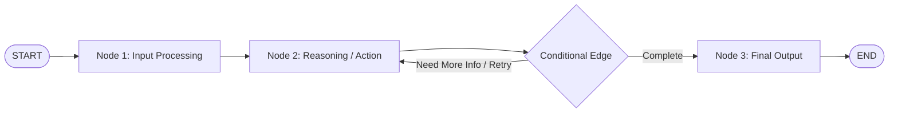
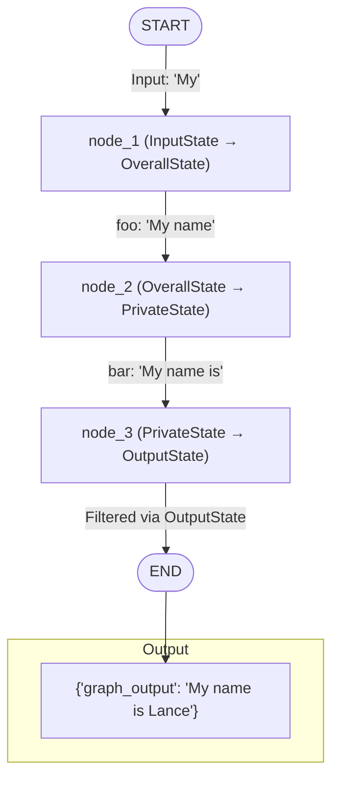
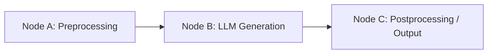
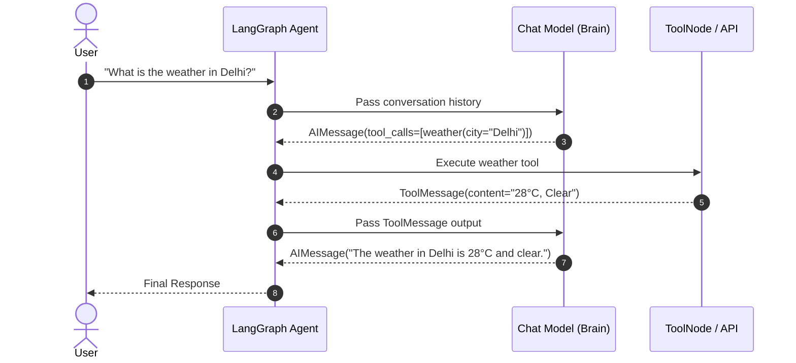
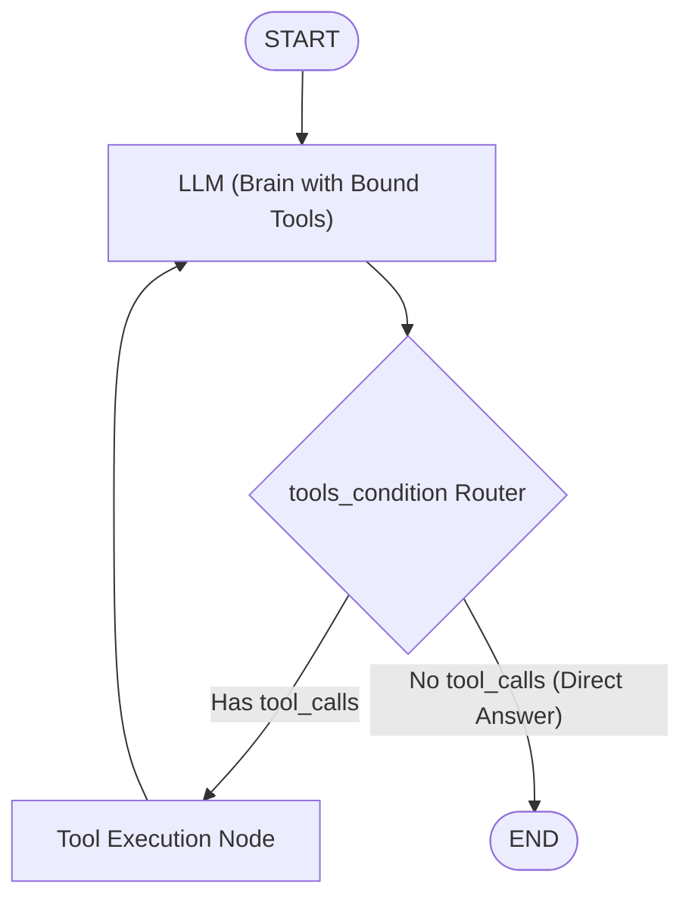
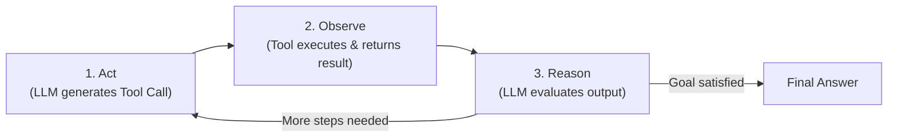
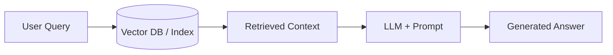
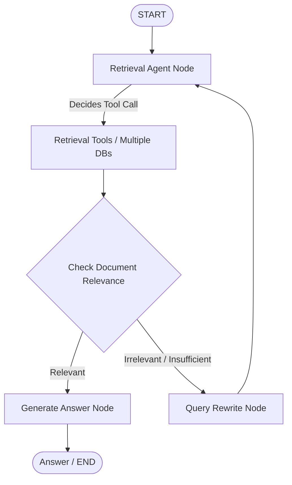
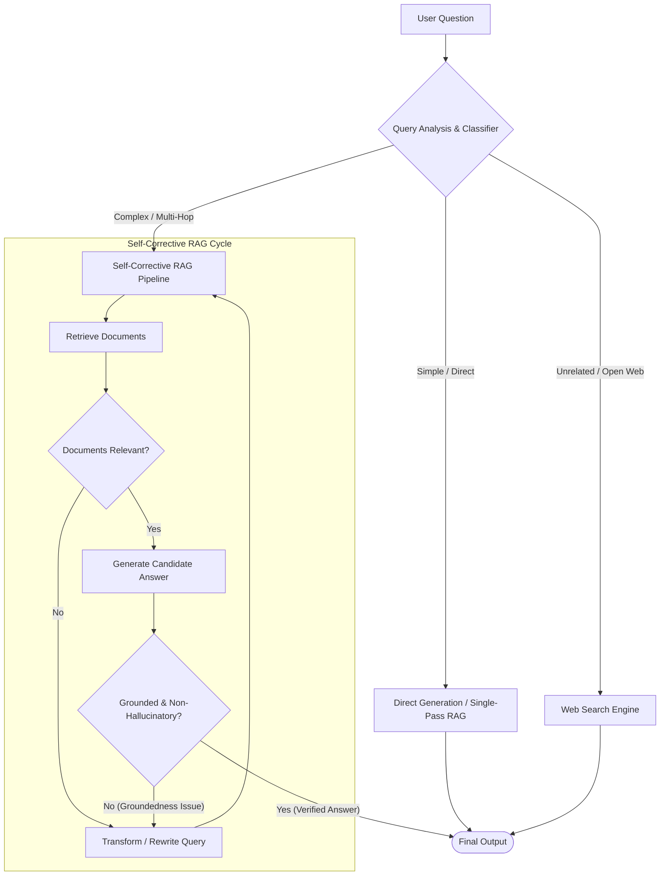

# 🦜🕸️ LangGraph & Agent Architectures — Complete Technical Reference

A comprehensive, modular study guide and production reference covering LangGraph primitives, state schemas, chains, routing patterns, ReAct agent loops, streaming, memory, and tool integration.

---

## 📑 Quick Navigation & Modules

| Module | Focus Area | Key Concepts |
| :--- | :--- | :--- |
| **[Module 1: Core Architecture & Fundamentals](#-module-1-langgraph-core-architecture--fundamentals)** | Graph Primitives & Schemas | State, Nodes, Edges, Multi-Schema (`input`/`output`/`overall`), `.compile()` |
| **[Module 2: Chains, Messages & Tool Integration](#-module-2-chains-messages--tool-integration)** | Sequential Logic & Tools | Chat Messages, Model Binding, Tool Execution Lifecycle |
| **[Module 3: Router Pattern & Conditional Branching](#-module-3-router-pattern--conditional-branching)** | Dynamic Execution Paths | LLM-as-Router, Workflow vs Agent Graph, Architecture Diagrams |
| **[Module 4: Agent Architectures, ReAct Loop & Advanced Runtime](#-module-4-agent-architectures-react-loop--advanced-runtime)** | Autonomous Agents & Streaming | ReAct Loop, `add_messages` Reducer, `MemorySaver`, Token Streaming (`astream_events`) |
| **[Module 5: RAG Architectures (Traditional, Agentic & Adaptive)](#-module-5-rag-architectures-traditional-agentic--adaptive)** | Advanced Retrieval Paradigms | Single-Pass RAG, Self-Corrective Loops, Document & Hallucination Grading, Query Routing |

---

<details>
<summary><h3>📦 Module 1: LangGraph Core Architecture & Fundamentals</h3></summary>

# 1. LangGraph Core Architecture & Fundamentals

## 1.1 Core Mental Model

At its core, **LangGraph** models agentic workflows as **stateful multi-actor graphs**. Unlike traditional linear chains (DAGs), LangGraph allows:
- **Cyclic loops** for reasoning, reflection, and iterative tool calling.
- **Explicit state tracking** across multiple steps.
- **Fine-grained control** over execution paths, human-in-the-loop interventions, and persistence.



---

## 1.2 The Three Pillars of LangGraph

Every LangGraph application is composed of three primary primitives:

### 1. State
* **Definition:** A shared data structure representing the current snapshot of your application at any point during graph execution.
* **Characteristics:**
  - Typically defined using Python's `TypedDict`, `dataclass`, or Pydantic `BaseModel`.
  - Serves as the central communication channel between nodes.
  - Can be updated via direct overwrite (default) or through custom **reducers** (e.g., `add_messages` for message lists).

### 2. Nodes
* **Definition:** Python functions or callables that encode the actual business logic or agent computation.
* **Signature:** Accept the current `state` (and optionally a `config` / `RunnableConfig`) as input, perform computation (LLM calls, tool execution, transformations), and return a dictionary of state updates.
```python
def my_node(state: MyState) -> dict:
    # Perform computation
    return {"updated_field": "new_value"}
```

### 3. Edges
* **Definition:** Directives that control the control flow between nodes.
* **Types:**
  - **Fixed (Normal) Edges:** Direct unconditional one-way transitions (`builder.add_edge("node_a", "node_b")`).
  - **Conditional Edges:** Dynamic branches determined by a router function (`builder.add_conditional_edges("node_a", routing_function)`).
  - **Entry & Exit Points:** Special edges connecting the virtual boundary nodes `START` and `END` to your graph nodes.

---

## 1.3 StateGraph & Schema Architecture

The `StateGraph` class is the primary graph builder. It is parameterized by your user-defined state structure.

### State Separation: Input, Output, Overall & Private States

In production architectures, you often want to restrict what inputs the graph accepts, what internal scratchpad state nodes use, and what final outputs are exposed to callers. LangGraph supports explicit schema separation:

| Schema Type | Purpose | How It Is Defined |
| :--- | :--- | :--- |
| **Overall State** | The complete shared state containing all global keys. | `StateGraph(OverallState, ...)` |
| **Input Schema** | Restricts/validates the keys allowed when calling `.invoke()`. | `input_schema=InputState` |
| **Output Schema** | Filters the final returned dictionary, hiding internal keys. | `output_schema=OutputState` |
| **Private Node State** | Scoped type hints for nodes reading/writing specific sub-keys. | Local `TypedDict` annotations on node functions |

---

## 1.4 Compiling the Graph (`.compile()`)

Before executing a graph, you must compile it via `builder.compile()`.

### What Compilation Does
1. **Topology Validation:**
   - Checks that all referenced nodes exist and have valid incoming/outgoing edges.
   - Detects orphaned nodes and invalid routing paths.
   - Ensures `START` and `END` nodes are properly connected.
2. **Builds a Runnable:**
   - Transforms the mutable `StateGraph` builder into an immutable, executable `CompiledGraph` implementing the LangChain Runnable interface (`.invoke()`, `.stream()`, `.astream()`, `.batch()`).

### Why Compilation is Required
Compilation is the bridge between **graph definition** and **graph runtime**. It is the stage where you attach runtime infrastructure:
- **Persistence & Checkpointing:** Pass a `checkpointer` (e.g., `MemorySaver`, `SqliteSaver`, `PostgresSaver`) for multi-turn memory and state rollbacks.
- **Human-in-the-Loop:** Set breakpoints (`interrupt_before` or `interrupt_after`) to pause execution for user confirmation or tool review.
- **Execution Settings:** Configure concurrency limits and node timeouts.

---

## 1.5 End-to-End Implementation Example

The following example demonstrates multi-schema state management (Input, Overall, Private, and Output) compiled into an executable pipeline.

```python
from typing import TypedDict
from langgraph.graph import END, START, StateGraph

# ==========================================
# 1. State Schemas Definition
# ==========================================

class InputState(TypedDict):
    """Schema for graph inputs (exposed to external callers)."""
    user_input: str

class OutputState(TypedDict):
    """Schema for final graph output (hides internal working fields)."""
    graph_output: str

class OverallState(TypedDict):
    """Global graph state holding all synchronized fields."""
    foo: str
    user_input: str
    graph_output: str

class PrivateState(TypedDict):
    """Intermediate state format used internally between nodes."""
    bar: str


# ==========================================
# 2. Node Functions (Workers)
# ==========================================

def node_1(state: InputState) -> OverallState:
    """Reads user_input from input state and writes 'foo' to OverallState."""
    return {"foo": state["user_input"] + " name"}

def node_2(state: OverallState) -> PrivateState:
    """Reads 'foo' from OverallState and writes intermediate 'bar'."""
    return {"bar": state["foo"] + " is"}

def node_3(state: PrivateState) -> OutputState:
    """Reads 'bar' and generates the final 'graph_output'."""
    return {"graph_output": state["bar"] + " Lance"}


# ==========================================
# 3. Graph Assembly & Compilation
# ==========================================

builder = StateGraph(
    OverallState, 
    input_schema=InputState, 
    output_schema=OutputState
)

# Add worker nodes
builder.add_node("node_1", node_1)
builder.add_node("node_2", node_2)
builder.add_node("node_3", node_3)

# Define sequential execution flow
builder.add_edge(START, "node_1")
builder.add_edge("node_1", "node_2")
builder.add_edge("node_2", "node_3")
builder.add_edge("node_3", END)

# Compile the graph into a runnable instance
graph = builder.compile()


# ==========================================
# 4. Execution
# ==========================================

if __name__ == "__main__":
    result = graph.invoke({"user_input": "My"})
    print("Final Output:", result)
    # Output: {'graph_output': 'My name is Lance'}
```

### Execution Flow Diagram



</details>

---

<details>
<summary><h3>🔗 Module 2: Chains, Messages & Tool Integration</h3></summary>

# 2. Chains, Messages & Tool Integration

## 2.1 Understanding Chains

* A **chain** is a sequence of connected steps (nodes) that work together to complete a workflow.
* In LangGraph, nodes are connected to control how information flows through the application state.
* Chains support both **linear sequences** and **complex branched workflows** that adapt dynamically based on runtime conditions.



---

## 2.2 Chat Messages & State History

Chat messages represent the discrete communication steps between the user, the model, and external tools:

| Message Type | Role & Description |
| :--- | :--- |
| **`HumanMessage`** | Input sent directly by the user. |
| **`AIMessage`** | Response generated by the language model (may include natural text or `tool_calls`). |
| **`ToolMessage`** | Output produced by executing an external tool, returned to the model. |
| **`SystemMessage`** | High-level instructions guiding model persona, rules, and behavior constraints. |

### Context Preservation
Explicit message tagging allows LangGraph to maintain conversation history, separate assistant reasoning from external tool observation, and prevent prompt pollution.

---

## 2.3 Chat Models in Nodes

A **Chat Model** is an LLM wrapper designed for structured message inputs and outputs.

* Placed inside graph **nodes** as worker functions.
* Can be parameterized with different model tiers (e.g., fast routing models vs reasoning heavy models).
* Receives conversation state and emits an `AIMessage`.

```
User Message ──► Node ──► Chat Model ──► AIMessage Update
```

---

## 2.4 Binding Tools to Models

**Tools** allow language models to interface with external APIs, databases, code execution sandboxes, and search engines.

```python
# Binding tools to a chat model
llm_with_tools = llm.bind_tools([weather_tool, search_tool, calculator_tool])
```

Binding tools converts Python function signatures and docstrings into standard JSON schemas (OpenAI function calling format) and informs the LLM of its available capabilities.

---

## 2.5 Executing Tool Calls Lifecycle



### Key Takeaways
1. **Separation of Concerns:** The LLM decides *which* tool to call and with *what arguments*; the graph is responsible for *executing* the tool and feeding back the result.
2. **Environment Configuration:** API credentials (`OPENAI_API_KEY`, `TAVILY_API_KEY`, `GROQ_API_KEY`) should always be managed securely via `.env`.

</details>

---

<details>
<summary><h3>🔀 Module 3: Router Pattern & Conditional Branching</h3></summary>

# 3. Router Pattern & Conditional Branching

## 3.1 Architecture Overview

The **Router Pattern** uses the LLM as an intelligent decision-maker (the "Brain") that analyzes incoming input and decides whether to respond directly with natural language or route execution through an external tool path.

<div align="center">
  
  <br/><br/>
  
</div>

---

## 3.2 Workflow vs. Basic Agent Structure

| Feature | Static Workflow | Basic Agent Graph |
| :--- | :--- | :--- |
| **Path Determination** | Pre-programmed, static transitions. | Dynamic, model-driven conditional branching. |
| **Decision Maker** | Hardcoded conditional Python functions. | LLM analyzing message history and tool schemas. |
| **Flow Pattern** | `START` $\rightarrow$ `Node A` $\rightarrow$ `Node B` $\rightarrow$ `END` | `START` $\rightarrow$ `LLM` $\rightarrow$ `tools_condition` $\rightarrow$ (`ToolNode` $\leftrightarrow$ `LLM`) / `END` |

---

## 3.3 Execution Steps (Basic Agent Flow)



1. **Step 1 (Input Processing):** Graph execution starts and passes user input into the LLM node configured with bound tools.
2. **Step 2 (Direct Response Path):** If no tools are required, the model generates text and routes directly to `END`.
3. **Step 3 (Tool Execution Path):** If external capabilities are required, the model emits tool calls. Execution branches to `ToolNode`, runs the tool, appends `ToolMessage`, and returns to the LLM for final synthesis.

</details>

---

<details>
<summary><h3>🤖 Module 4: Agent Architectures, ReAct Loop & Advanced Runtime</h3></summary>

# 4. Agent Architectures, ReAct Loop & Advanced Runtime

## 4.1 Core Concepts & Components

* **Chains & Routers:** Logic frameworks that steer execution pathways based on input evaluation.
* **Tools:** External APIs, custom functions, or databases that models trigger to run specific actions or computations.
* **LangSmith:** Unified observability platform used for tracing latency, token consumption, and debugging agent execution paths.

---

## 4.2 ReAct Agent Architecture (Reason + Act)

The **ReAct** pattern implements an iterative decision cycle:

$$\mathbf{Act} \longrightarrow \mathbf{Observe} \longrightarrow \mathbf{Reason}$$



### Multi-Step Calculation Example
* **User Query:** "What is $(5 + 5) \times 3$?"
* **Step 1 (Act):** Call `add(a=5, b=5)`
* **Step 2 (Observe):** Output is `10`
* **Step 3 (Reason & Act):** Call `multiply(a=10, b=3)`
* **Step 4 (Observe):** Output is `30`
* **Step 5 (Reason & Finish):** Final Answer: `"30"`

---

## 4.3 State Management & Reducers

### TypedDict State Schema
```python
from typing import Annotated, TypedDict
from langchain_core.messages import AnyMessage
from langgraph.graph.message import add_messages

class AgentState(TypedDict):
    # 'add_messages' reducer appends new messages rather than overwriting
    messages: Annotated[list[AnyMessage], add_messages]
```

### Why Reducers are Required
By default, LangGraph **overwrites** state keys with whatever a node returns. With conversational agents, we must preserve message history. The `add_messages` reducer:
- Appends new messages to the existing list.
- Updates existing messages if they share matching `id` attributes.

---

## 4.4 Short-Term Memory & Checkpointers

Using `MemorySaver`, LangGraph retains conversation state across multiple independent user invocations using a `thread_id`:

```python
from langgraph.checkpoint.memory import MemorySaver

memory = MemorySaver()
app = builder.compile(checkpointer=memory)

config = {"configurable": {"thread_id": "session-123"}}
response = app.invoke({"messages": [("user", "My name is Alice")]}, config=config)
```

---

## 4.5 Streaming Modes & Token-Level Streaming

LangGraph provides multiple streaming mechanisms to power interactive UIs:

| Streaming Method | Mode / API | Description |
| :--- | :--- | :--- |
| **Node State Updates** | `.stream(..., stream_mode="updates")` | Emits state diffs produced only by the completing node. |
| **Full Graph State** | `.stream(..., stream_mode="values")` | Emits the complete, unified state tree after each step. |
| **Token-Level Streaming** | `.astream_events(..., version="v2")` | Emits granular LLM tokens in real time alongside metadata (`event`, `name`, `data`, `langgraph_node`). |

### Token Streaming Pattern (`astream_events`)
```python
async for event in app.astream_events(inputs, version="v2"):
    kind = event["event"]
    if kind == "on_chat_model_stream":
        content = event["data"]["chunk"].content
        if content:
            print(content, end="", flush=True)
```

</details>

---

<details>
<summary><h3>🔍 Module 5: RAG Architectures (Traditional, Agentic & Adaptive)</h3></summary>

# 5. Types of RAG Architectures

A comparative breakdown of retrieval paradigms from simple linear pipelines to autonomous and adaptive multi-strategy systems.

---

## 5.1 Architecture Comparison Matrix

| Dimension | 1. Traditional RAG | 2. Agentic RAG | 3. Adaptive RAG |
| :--- | :--- | :--- | :--- |
| **Control Flow** | Fixed Linear Pipeline (DAG) | Dynamic Cyclic Loops | Dynamic Multi-Strategy Routing |
| **Decision Maker** | None (Deterministic) | Autonomous Agent / LLM | Query Classifier + Self-Reflection Loops |
| **Retrieval Timing** | Always executes 1-pass retrieval | Decides *if*, *when*, & *where* to retrieve | Routes based on query complexity & domain |
| **Failure Recovery** | None (risk of hallucinations) | Query Rewriting on irrelevant docs | Multi-stage grading (Docs + Hallucinations) |
| **Best Used For** | Simple, static Q&A over uniform text | Complex multi-source or multi-tool queries | Enterprise production systems with varied queries |

---

## 5.2 1. Traditional RAG

### Mechanism
A single, direct linear execution flow:

$$\text{User Query} \longrightarrow \text{Vector Index / DB} \longrightarrow \text{Context Retrieval} \longrightarrow \text{LLM + Prompt} \longrightarrow \text{Answer}$$



### Limitations
- **Rigid Pipeline:** Follows the same retrieval path regardless of question complexity or relevance.
- **No Self-Evaluation:** Cannot assess whether the retrieved documents are actually relevant before feeding them to the generator.
- **Single Point of Failure:** Poor retrieval inevitably produces hallucinated or low-quality answers with no opportunity for query correction.

<details>
<summary><b>💻 Code: Basic Traditional RAG Graph</b></summary>

```python
from typing import TypedDict
from langgraph.graph import StateGraph, START, END
from langchain_openai import ChatOpenAI, OpenAIEmbeddings
from langchain_community.vectorstores import FAISS

# 1. State Schema
class TraditionalRAGState(TypedDict):
    question: str
    context: list[str]
    answer: str

# 2. Vector DB & Model Setup
vectorstore = FAISS.from_texts(
    ["LangGraph allows building cyclical agent workflows and structured multi-actor graphs."],
    embedding=OpenAIEmbeddings()
)
retriever = vectorstore.as_retriever(search_kwargs={"k": 2})
llm = ChatOpenAI(model="gpt-4o-mini", temperature=0)

# 3. Worker Nodes
def retrieve(state: TraditionalRAGState) -> dict:
    docs = retriever.invoke(state["question"])
    return {"context": [d.page_content for d in docs]}

def generate(state: TraditionalRAGState) -> dict:
    context_str = "\n".join(state["context"])
    prompt = f"Answer based on context:\n{context_str}\n\nQuestion: {state['question']}"
    response = llm.invoke(prompt)
    return {"answer": response.content}

# 4. Assemble Linear Graph
workflow = StateGraph(TraditionalRAGState)
workflow.add_node("retrieve", retrieve)
workflow.add_node("generate", generate)

workflow.add_edge(START, "retrieve")
workflow.add_edge("retrieve", "generate")
workflow.add_edge("generate", END)

traditional_rag = workflow.compile()
```

</details>

---

## 5.3 2. Agentic RAG

### Core Concept
Integrates an **autonomous retrieval agent** that controls tool invocation, evaluates intermediate results, and dynamically corrects queries via cyclic feedback loops.



### Key Components
1. **Retrieval Agent (Brain):** Determines whether retrieval is necessary, selects target data stores (e.g., SQL, Vector DB, Web), and formulates search parameters.
2. **Document Relevance Grading Node:** Uses structured grading criteria to evaluate retrieved documents against the user's intent.
3. **Query Rewrite Node:** If retrieved documents fail the relevance threshold, reformulates the search query to improve keyword coverage and semantic alignment.
4. **Tool Execution Node:** Dynamically triggers function calls to fetch context from heterogeneous indexes.

<details>
<summary><b>💻 Code: Agentic RAG with Relevance Grading & Query Rewriter</b></summary>

```python
from typing import TypedDict, Literal
from langgraph.graph import StateGraph, START, END
from langchain_core.messages import HumanMessage
from langchain_openai import ChatOpenAI
from pydantic import BaseModel, Field

# 1. State Schema with retry tracking
class AgenticRAGState(TypedDict):
    question: str
    documents: list[str]
    generation: str
    retry_count: int

# 2. Structured Document Grader
class GradeDocuments(BaseModel):
    """Binary score for document relevance check."""
    binary_score: str = Field(description="Documents are relevant to question, 'yes' or 'no'")

llm = ChatOpenAI(model="gpt-4o-mini", temperature=0)
doc_grader = llm.with_structured_output(GradeDocuments)

# 3. Worker & Evaluation Nodes
def retrieve(state: AgenticRAGState) -> dict:
    docs = retriever.invoke(state["question"])
    return {"documents": [d.page_content for d in docs]}

def grade_documents(state: AgenticRAGState) -> dict:
    """Filter retrieved documents based on relevance."""
    filtered_docs = []
    for doc in state["documents"]:
        score = doc_grader.invoke(
            f"Question: {state['question']}\nDocument: {doc}"
        )
        if score.binary_score.lower() == "yes":
            filtered_docs.append(doc)
    return {"documents": filtered_docs}

def decide_to_generate(state: AgenticRAGState) -> Literal["generate", "rewrite"]:
    """Conditional router: rewrite query if no relevant docs exist."""
    if not state["documents"] and state.get("retry_count", 0) < 3:
        return "rewrite"
    return "generate"

def rewrite_query(state: AgenticRAGState) -> dict:
    """Transform user question to improve search recall."""
    msg = [HumanMessage(content=f"Rewrite this search query to optimize vector retrieval: {state['question']}")]
    better_query = llm.invoke(msg).content
    return {
        "question": better_query, 
        "retry_count": state.get("retry_count", 0) + 1
    }

def generate(state: AgenticRAGState) -> dict:
    context = "\n".join(state["documents"]) if state["documents"] else "No specific documents found."
    res = llm.invoke(f"Context:\n{context}\n\nQuestion: {state['question']}")
    return {"generation": res.content}

# 4. Assemble Cyclic Agentic Graph
workflow = StateGraph(AgenticRAGState)
workflow.add_node("retrieve", retrieve)
workflow.add_node("grade_documents", grade_documents)
workflow.add_node("rewrite", rewrite_query)
workflow.add_node("generate", generate)

workflow.add_edge(START, "retrieve")
workflow.add_edge("retrieve", "grade_documents")
workflow.add_conditional_edges(
    "grade_documents",
    decide_to_generate,
    {"generate": "generate", "rewrite": "rewrite"}
)
workflow.add_edge("rewrite", "retrieve")
workflow.add_edge("generate", END)

agentic_rag = workflow.compile()
```

</details>

---

## 5.4 3. Adaptive RAG

### Core Concept
Dynamically assesses incoming query complexity and routes requests across distinct execution strategies, optimizing both latency and accuracy.



### Routing Logic & Strategies
* **Simple Queries:** Bypasses heavy multi-hop retrieval for single-step answers or direct LLM responses.
* **Unrelated Queries:** Routes non-domain or real-time queries to live search APIs (e.g., Tavily, Google Search).
* **Complex Queries:** Directs multi-hop reasoning questions into the **Self-Corrective RAG Pipeline**.

### Self-Corrective Dual-Grading System
1. **Document Relevance Grading:** Assesses whether retrieved chunks contain sufficient evidence.
2. **Hallucination & Groundedness Grading:** Evaluates whether the generated response is strictly factually supported by retrieved documents, triggering automated query transformation and retry loops if hallucinations are detected.

<details>
<summary><b>💻 Code: Adaptive RAG (Router + Self-Corrective RAG)</b></summary>

```python
from typing import TypedDict, Literal
from langgraph.graph import StateGraph, START, END
from langchain_openai import ChatOpenAI
from pydantic import BaseModel, Field

# 1. State Schema
class AdaptiveRAGState(TypedDict):
    question: str
    documents: list[str]
    generation: str

# 2. Query Classification Router
class RouteQuery(BaseModel):
    """Route user query to the most appropriate data source."""
    datasource: Literal["vectorstore", "web_search", "direct"] = Field(
        description="Select 'vectorstore' for domain knowledge, 'web_search' for recent news/web info, 'direct' for general knowledge/chit-chat."
    )

llm = ChatOpenAI(model="gpt-4o-mini", temperature=0)
question_router = llm.with_structured_output(RouteQuery)

# 3. Router & Execution Nodes
def route_question(state: AdaptiveRAGState) -> Literal["vectorstore", "web_search", "direct"]:
    """Classifies query and returns target execution branch."""
    decision = question_router.invoke({"question": state["question"]})
    return decision.datasource

def web_search(state: AdaptiveRAGState) -> dict:
    """Mock/Tavily web search execution."""
    return {"documents": [f"Web search summary for: {state['question']}"]}

def retrieve(state: AdaptiveRAGState) -> dict:
    """Internal vector index retrieval."""
    docs = retriever.invoke(state["question"])
    return {"documents": [d.page_content for d in docs]}

def direct_generate(state: AdaptiveRAGState) -> dict:
    """Bypasses retrieval for simple/general questions."""
    res = llm.invoke(state["question"])
    return {"generation": res.content}

def generate(state: AdaptiveRAGState) -> dict:
    """Context-grounded answer generation."""
    context = "\n".join(state["documents"])
    res = llm.invoke(f"Context:\n{context}\n\nQuestion: {state['question']}")
    return {"generation": res.content}

# 4. Assemble Adaptive Graph with Dynamic Entry Point
workflow = StateGraph(AdaptiveRAGState)
workflow.add_node("retrieve", retrieve)
workflow.add_node("web_search", web_search)
workflow.add_node("direct_generate", direct_generate)
workflow.add_node("generate", generate)

# Dynamic routing directly from START
workflow.add_conditional_edges(
    START,
    route_question,
    {
        "vectorstore": "retrieve",
        "web_search": "web_search",
        "direct": "direct_generate"
    }
)

workflow.add_edge("retrieve", "generate")
workflow.add_edge("web_search", "generate")
workflow.add_edge("generate", END)
workflow.add_edge("direct_generate", END)

adaptive_rag = workflow.compile()
```

</details>

</details>

---

## 📚 Repository Learning Path

| Source File / Directory | Topic Covered |
| :--- | :--- |
| [`Langgraph_basics/1-simplegraph.ipynb`](file:///c:/Users/DELL/Desktop/rag_practice2/Langgraph_basics/1-simplegraph.ipynb) | Basic state graphs, node registration, and conditional routing |
| [`Langgraph_basics/2-chatbot.ipynb`](file:///c:/Users/DELL/Desktop/rag_practice2/Langgraph_basics/2-chatbot.ipynb) | Conversational agents, state reducers (`add_messages`), and streaming |
| [`Langgraph_basics/3-DataclassStateSchema.ipynb`](file:///c:/Users/DELL/Desktop/rag_practice2/Langgraph_basics/3-DataclassStateSchema.ipynb) | State schemas using Python `@dataclass` |
| [`Langgraph_basics/4-pydantic.ipynb`](file:///c:/Users/DELL/Desktop/rag_practice2/Langgraph_basics/4-pydantic.ipynb) | Runtime state validation using Pydantic `BaseModel` |
| [`Langgraph_basics/5-ChainsLangGraph.ipynb`](file:///c:/Users/DELL/Desktop/rag_practice2/Langgraph_basics/5-ChainsLangGraph.ipynb) | Translating LangChain chains into modular LangGraph graphs |
| [`Langgraph_basics/6-chatbotswithmultipletools.ipynb`](file:///c:/Users/DELL/Desktop/rag_practice2/Langgraph_basics/6-chatbotswithmultipletools.ipynb) | Multi-tool ReAct agents (Arxiv, Wikipedia, Calculator) |
| [`agent architecture/1-streaming.ipynb`](file:///c:/Users/DELL/Desktop/rag_practice2/agent%20architecture/1-streaming.ipynb) | Real-time state and token streaming (`astream_events`) |
| [`agent architecture/7-ReActAgents.ipynb`](file:///c:/Users/DELL/Desktop/rag_practice2/agent%20architecture/7-ReActAgents.ipynb) | Complete ReAct agent workflows with multi-step tool calling |
| [`notes.md`](file:///c:/Users/DELL/Desktop/rag_practice2/notes.md) | Comprehensive technical study guide and deep-dive theory |
