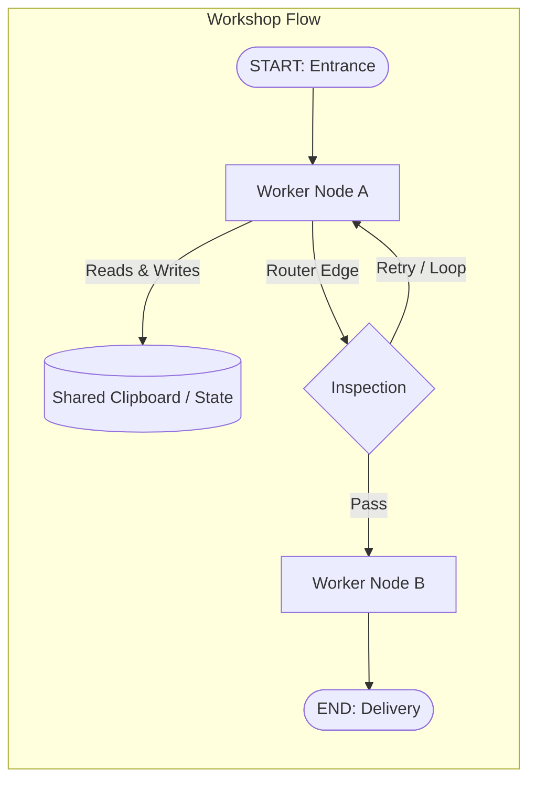
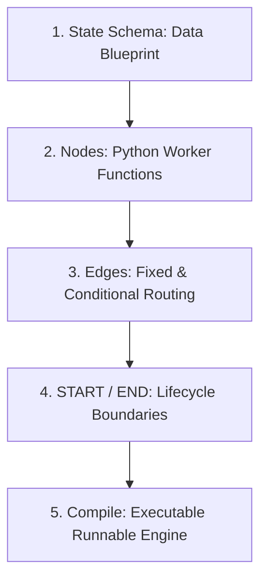
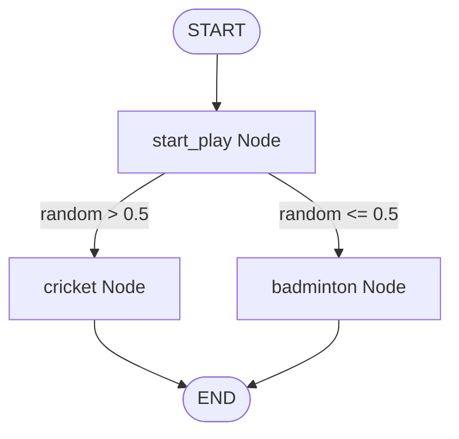
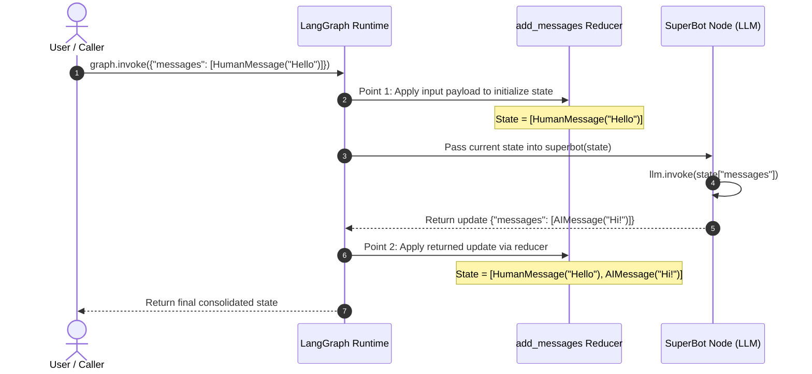
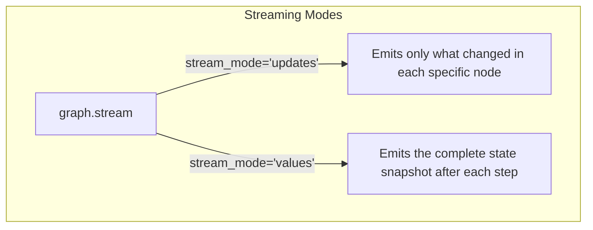
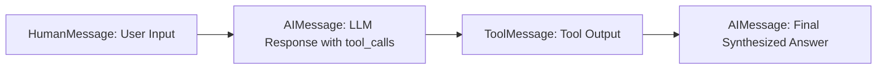
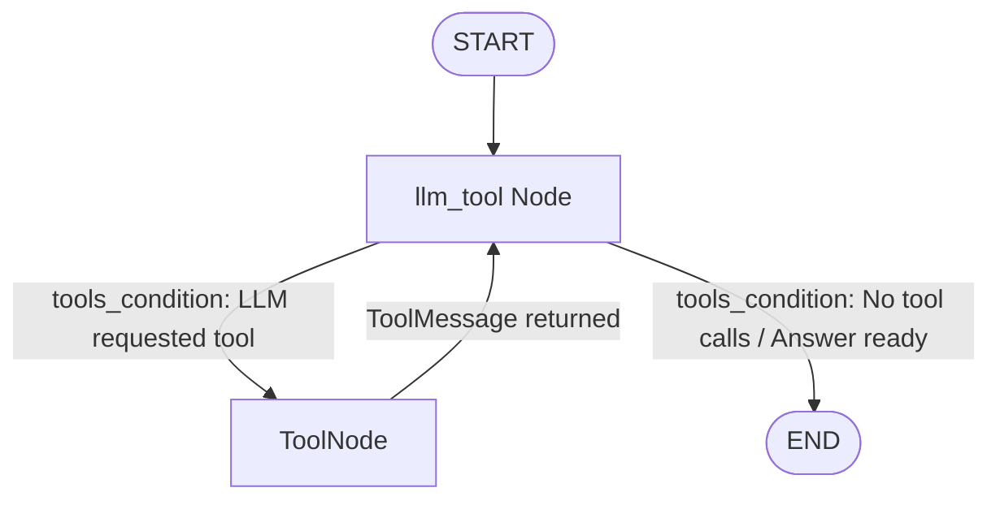
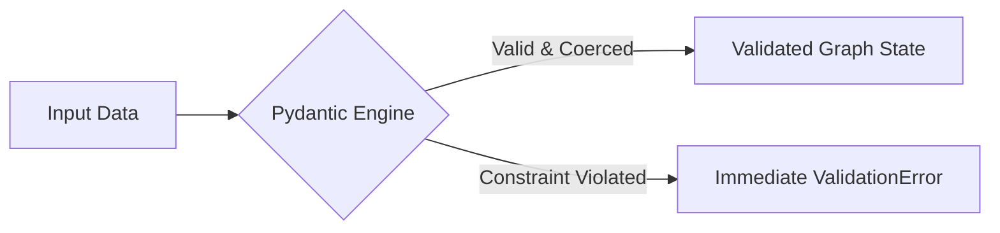

# LangGraph Mastery: The Intuitive, Technical Study Guide

> **Target Audience:** Data Scientists & AI Engineers  
> **Source Material:** `Langgraph_basics/` Notebooks (`1-simplegraph.ipynb` $\rightarrow$ `6-chatbotswithmultipletools.ipynb`)  
> **Focus:** Rigorous architectural clarity, plain-English mental models, and production patterns.

---

## 📑 Table of Contents
1. [Part 1: The Core Mental Model & Graph Foundations](#1-the-core-mental-model--graph-foundations)
   - [The Analogy: The "Shared Clipboard" Workshop](#the-analogy-the-shared-clipboard-workshop)
   - [Why LangGraph? (Linear Chains vs Cyclic State Machines)](#why-langgraph-linear-chains-vs-cyclic-state-machines)
   - [The 5 Core Building Blocks](#the-5-core-building-blocks)
   - [Hands-on: Building Your First Graph (`1-simplegraph.ipynb`)](#hands-on-building-your-first-graph-1-simplegraphipynb)
2. [Part 2: Conversational Agents & State Reducers](#2-conversational-agents--state-reducers)
   - [Jargon Buster: What is a "Reducer"?](#jargon-buster-what-is-a-reducer)
   - [The `add_messages` Reducer (`2-chatbot.ipynb`)](#the-add_messages-reducer-2-chatbotipynb)
   - [Under the Hood: The 2-Point State Update Lifecycle](#under-the-hood-the-2-point-state-update-lifecycle)
   - [Chatbot Node with LLMs (Groq / OpenAI)](#chatbot-node-with-llms-groq--openai)
   - [Real-time Streaming: `updates` vs `values`](#real-time-streaming-updates-vs-values)
3. [Part 3: Autonomous Agents & Tool Calling (ReAct Loop)](#3-autonomous-agents--tool-calling-react-loop)
   - [The 4 Message Types in LangChain / LangGraph](#the-4-message-types-in-langchain--langgraph)
   - [Defining Custom Tools with `@tool` (`5-ChainsLangGraph.ipynb`)](#defining-custom-tools-with-tool-5-chainslanggraphipynb)
   - [Binding Tools to LLMs (`llm.bind_tools()`)](#binding-tools-to-llms-llmbind_tools)
   - [Prebuilt Helpers: `ToolNode` and `tools_condition`](#prebuilt-helpers-toolnode-and-tools_condition)
   - [The ReAct Cycle: Full Trace & Execution Walkthrough](#the-react-cycle-full-trace--execution-walkthrough)
   - [Multi-Tool Assistants: Arxiv, Wikipedia & Safe Math (`6-chatbotswithmultipletools.ipynb`)](#multi-tool-assistants-arxiv-wikipedia--safe-math-6-chatbotswithmultipletoolsipynb)
   - [Production Shortcut: `create_react_agent`](#production-shortcut-create_react_agent)
4. [Part 4: State Schema Architectures & Data Validation](#4-state-schema-architectures--data-validation)
   - [Schema Option 1: `TypedDict` (`state["key"]`) (`3-DataclassStateSchema.ipynb`)](#schema-option-1-typeddict-statekey-3-dataclassstateschemaipynb)
   - [Schema Option 2: `@dataclass` (`state.key`)](#schema-option-2-dataclass-statekey)
   - [Input Flexibility: Dataclass Object vs Raw Dictionary](#input-flexibility-dataclass-object-vs-raw-dictionary)
   - [Schema Option 3: Production Validation with Pydantic (`4-pydantic.ipynb`)](#schema-option-3-production-validation-with-pydantic-4-pydanticipynb)
   - [Field Constraints, Automatic Coercion & Runtime Errors](#field-constraints-automatic-coercion--runtime-errors)
5. [Part 5: Comprehensive Quick-Reference Cheat Sheet](#5-comprehensive-quick-reference-cheat-sheet)
   - [State Schema Architectural Comparison Matrix](#state-schema-architectural-comparison-matrix)
   - [LangGraph Core API Quick Reference](#langgraph-core-api-quick-reference)
   - [Common Gotchas & Best Practices Checklist](#common-gotchas--best-practices-checklist)

---

# 1. The Core Mental Model & Graph Foundations

### The Analogy: The "Shared Clipboard" Workshop
Imagine an assembly line workshop where workers collaborate on a project:
- In the center of the room sits a **Shared Clipboard (State)** containing the project documents, instructions, and history.
- Each specialist worker at a workstation is a **Node**. A worker takes the clipboard, reads relevant fields, performs their specific task (e.g., writes code, calls an API, or calculates a value), and writes their update back onto the clipboard.
- The supervisor instructions on which desk to visit next are the **Edges** (direct roads or conditional decision branches).
- The entrance is **START**, and the shipping dock is **END**.



---

### Why LangGraph? (Linear Chains vs Cyclic State Machines)

Traditional LLM pipelines (e.g., standard LangChain `RunnableSequence` or LCEL) are **Directed Acyclic Graphs (DAGs)**—they only flow strictly forward in one direction.

| Feature | Standard Linear Chains (DAGs) | LangGraph (Cyclic Graphs) |
| :--- | :--- | :--- |
| **Execution Flow** | One-way pipeline ($A \rightarrow B \rightarrow C$) | Cyclic state machine ($A \rightarrow B \rightarrow A \rightarrow \dots$) |
| **Error Recovery** | Hard to loop back if output is flawed | Native loops for self-reflection & corrections |
| **Agent Reasoning** | Rigid single-pass execution | Multi-step ReAct loops (Reason $\rightarrow$ Act $\rightarrow$ Observe) |
| **State Management** | Passed through args down the chain | Centralized, persistent state schema |

---

### The 5 Core Building Blocks



1. **State Schema:** A data structure (`TypedDict`, `@dataclass`, or `Pydantic BaseModel`) defining what data the graph holds.
2. **Nodes:** Normal Python functions (`def node_fn(state) -> dict`) that receive the current state and return state updates.
3. **Edges:** Directional links that connect nodes.
   - **Normal Edge (`add_edge`):** Always goes from Node A to Node B.
   - **Conditional Edge (`add_conditional_edges`):** Calls a router function to dynamically choose the destination node.
4. **START & END:** Built-in virtual nodes marking the graph entrypoint and termination points.
5. **Compile (`builder.compile()`):** Validates the graph topology and produces a runnable `CompiledGraph`.

---

### Hands-on: Building Your First Graph (`1-simplegraph.ipynb`)

Let's build a simple graph where a user inputs text, a node plans an activity, a router randomly picks a sport (Cricket or Badminton), and the chosen node appends its decision.

#### Step 1: Define the State
```python
from typing import TypedDict

# The shared clipboard holds a single string: 'graph_info'
class State(TypedDict):
    graph_info: str
```

#### Step 2: Define Worker Nodes
> [!IMPORTANT]
> **Default State Overwrite Rule:** If no reducer is specified, returning a key in a node's output dictionary will **completely overwrite** the old value in the state.

```python
def start_play(state: State) -> dict:
    print("--- Executing: start_play ---")
    return {"graph_info": state['graph_info'] + " I am planning to play"}

def cricket(state: State) -> dict:
    print("--- Executing: cricket ---")
    return {"graph_info": state['graph_info'] + " Cricket"}

def badminton(state: State) -> dict:
    print("--- Executing: badminton ---")
    return {"graph_info": state['graph_info'] + " Badminton"}
```

#### Step 3: Define Conditional Routing Logic
A router function evaluates the state and returns the **string name** of the target node:

```python
import random
from typing import Literal

def random_play(state: State) -> Literal['cricket', 'badminton']:
    if random.random() > 0.5:
        return "cricket"
    else:
        return "badminton"
```

#### Step 4: Assemble, Compile, and Invoke



```python
from langgraph.graph import StateGraph, START, END

# 1. Initialize builder with schema
builder = StateGraph(State)

# 2. Register nodes
builder.add_node("start_play", start_play)
builder.add_node("cricket", cricket)
builder.add_node("badminton", badminton)

# 3. Connect nodes with edges
builder.add_edge(START, "start_play")
builder.add_conditional_edges("start_play", random_play)
builder.add_edge("cricket", END)
builder.add_edge("badminton", END)

# 4. Compile into an executable graph
graph = builder.compile()

# 5. Invoke with initial state payload
result = graph.invoke({"graph_info": "Hey My name is Krish"})
print(result)
# Sample Output: {'graph_info': 'Hey My name is Krish I am planning to play Cricket'}
```

---

# 2. Conversational Agents & State Reducers

### Jargon Buster: What is a "Reducer"?
In computer science, a **Reducer** is a function that takes existing data and incoming new data, and combines them into a single consolidated result.
- **Without a Reducer (Default):** `New State = Incoming Update` $\rightarrow$ Overwrites history.
- **With `add_messages` Reducer:** `New State = Existing Messages + Incoming Messages` $\rightarrow$ Preserves full chat history.

---

### The `add_messages` Reducer (`2-chatbot.ipynb`)

In multi-turn chat applications, we must preserve conversation history. LangGraph provides the `add_messages` reducer via Python's `Annotated` type hint:

```python
from typing import Annotated
from typing_extensions import TypedDict
from langchain_core.messages import AnyMessage, HumanMessage, AIMessage
from langgraph.graph.message import add_messages

class State(TypedDict):
    # Format: Annotated[Type, ReducerFunction]
    messages: Annotated[list[AnyMessage], add_messages]
```

#### What `add_messages` handles automatically:
1. **List Appending:** Appends new message items without deleting past messages.
2. **Message Deduplication / Update:** If a message shares an existing message `id`, it updates that message in-place (essential for streaming and editing).
3. **Type Coercion:** Automatically converts raw dictionaries (e.g. `{"role": "user", "content": "hi"}`) into standard LangChain `HumanMessage` / `AIMessage` objects.

---

### Under the Hood: The 2-Point State Update Lifecycle

In a standard chatbot turn, state updates occur at **two exact deterministic points**:



1. **Point 1 (Graph Entry / Input Injection):**
   - The user passes `{"messages": [HumanMessage(...)]}` to `graph.invoke()`.
   - LangGraph runs this payload through `add_messages`, creating the initial state list (length = 1).
2. **Point 2 (Node Return):**
   - The `superbot` node calls the LLM and returns `{"messages": [AIMessage(...)]}`.
   - LangGraph passes this dictionary through `add_messages`, appending the AI message to the existing list (length = 2).

---

### Chatbot Node with LLMs (Groq / OpenAI)

```python
import os
from dotenv import load_dotenv
from langchain_groq import ChatGroq
from langgraph.graph import StateGraph, START, END

load_dotenv()

# Initialize LLM client
llm = ChatGroq(model="llama-3.3-70b-versatile")

# Node function: passes full conversation history to LLM
def superbot(state: State) -> dict:
    response = llm.invoke(state["messages"])
    return {"messages": [response]}

# Assemble Graph
builder = StateGraph(State)
builder.add_node("SuperBot", superbot)
builder.add_edge(START, "SuperBot")
builder.add_edge("SuperBot", END)
graph = builder.compile()

# Test Run
output = graph.invoke({"messages": [HumanMessage(content="Hi, My name is Krish and I like cricket")]})
print(output["messages"])
```

---

### Real-time Streaming: `updates` vs `values`

When serving UI applications, use `graph.stream()` to output responses in real-time. LangGraph supports two primary stream modes:



#### 1. `stream_mode="updates"` (Delta updates from each node)
```python
for event in graph.stream(
    {"messages": [HumanMessage(content="Give 3 tips for cricket batting")]},
    stream_mode="updates"
):
    print(event)
    # Output: {'SuperBot': {'messages': [AIMessage(content='...')]}}
```

#### 2. `stream_mode="values"` (Consolidated state after each step)
```python
for state_snapshot in graph.stream(
    {"messages": [HumanMessage(content="Tell me a quick fact")]},
    stream_mode="values"
):
    print(f"Total messages in state: {len(state_snapshot['messages'])}")
```

---

# 3. Autonomous Agents & Tool Calling (ReAct Loop)

When an LLM needs real-time data, computational precision, or external actions, we equip it with **Tools** within a **ReAct loop** (**Re**ason $\rightarrow$ **Act** $\rightarrow$ Observe).

---

### The 4 Message Types in LangChain / LangGraph



1. **`SystemMessage`:** System instructions setting behavioral rules, roles, and constraints.
2. **`HumanMessage`:** User query or human feedback.
3. **`AIMessage`:** Response generated by the model. If the model wants to run a tool, this message contains metadata in its `tool_calls` attribute.
4. **`ToolMessage`:** Output payload returned from executing a tool function, keyed with `tool_call_id`.

---

### Defining Custom Tools with `@tool` (`5-ChainsLangGraph.ipynb`)

The `@tool` decorator turns any Python function into a structured tool.
> [!TIP]
> The function name, parameter type hints, and **docstring** are automatically converted into JSON Schema and sent to the LLM. Write clear docstrings!

```python
from langchain_core.tools import tool

@tool
def add(a: int, b: int) -> int:
    """Add two integers a and b."""
    return a + b

@tool
def multiply(a: int, b: int) -> int:
    """Multiply two integers a and b."""
    return a * b

tools = [add, multiply]
```

---

### Binding Tools to LLMs (`llm.bind_tools()`)

`bind_tools` informs the model about available functions:

```python
from langchain_groq import ChatGroq

llm = ChatGroq(model="llama-3.3-70b-versatile")
llm_with_tools = llm.bind_tools(tools)
```

---

### Prebuilt Helpers: `ToolNode` and `tools_condition`

LangGraph eliminates boilerplate code with two built-in utilities:
- **`ToolNode(tools)`**: A specialized node that inspects the latest `AIMessage`, extracts all requested `tool_calls`, executes the Python functions, and returns `ToolMessage` instances.
- **`tools_condition`**: A built-in router. If `AIMessage.tool_calls` is present, it routes to `"tools"`; otherwise, it routes to `END`.

---

### The ReAct Cycle: Full Trace & Execution Walkthrough



```python
from typing import Annotated
from typing_extensions import TypedDict
from langchain_core.messages import AnyMessage, HumanMessage
from langgraph.graph import StateGraph, START, END
from langgraph.graph.message import add_messages
from langgraph.prebuilt import ToolNode, tools_condition

class State(TypedDict):
    messages: Annotated[list[AnyMessage], add_messages]

def llm_tool(state: State) -> dict:
    return {"messages": [llm_with_tools.invoke(state["messages"])]}

builder = StateGraph(State)

# Add nodes
builder.add_node("llm_tool", llm_tool)
builder.add_node("tools", ToolNode(tools))

# Add edges & loop
builder.add_edge(START, "llm_tool")
builder.add_conditional_edges("llm_tool", tools_condition)
builder.add_edge("tools", "llm_tool")  # Feedback loop: returns tool output back to LLM

graph = builder.compile()
```

#### Step-by-Step Execution Trace for: `"What is 2 plus 2?"`
1. **START $\rightarrow$ `llm_tool`**:
   - Input: `[HumanMessage("What is 2 plus 2?")]`.
   - LLM recognizes it needs `add(a=2, b=2)` and outputs `AIMessage(tool_calls=[{'name': 'add', 'args': {'a': 2, 'b': 2}}])`.
2. **`tools_condition` Router**:
   - Detects `tool_calls` $\rightarrow$ routes execution to `"tools"`.
3. **`ToolNode` Execution**:
   - Invokes `add(a=2, b=2)` $\rightarrow$ returns `ToolMessage(content='4')`.
4. **`tools` $\rightarrow$ `llm_tool` (Loop Back)**:
   - State now contains: `[HumanMessage, AIMessage(tool_call), ToolMessage(4)]`.
   - LLM reads the tool output and synthesizes: `AIMessage("2 plus 2 is 4.")`.
5. **`tools_condition` Router**:
   - No further tool calls detected $\rightarrow$ routes to `END`.

---

### Multi-Tool Assistants: Arxiv, Wikipedia & Safe Math (`6-chatbotswithmultipletools.ipynb`)

We can integrate multiple external APIs and custom logic seamlessly:

```python
from langchain_community.tools import ArxivQueryRun, WikipediaQueryRun
from langchain_community.utilities import WikipediaAPIWrapper, ArxivAPIWrapper
from langchain_core.tools import tool

# 1. Arxiv Tool (Scientific Papers)
arxiv_wrapper = ArxivAPIWrapper(top_k_results=2, doc_content_chars_max=500)
arxiv = ArxivQueryRun(api_wrapper=arxiv_wrapper)

# 2. Wikipedia Tool (General Knowledge)
wiki_wrapper = WikipediaAPIWrapper(top_k_results=1, doc_content_chars_max=500)
wiki = WikipediaQueryRun(api_wrapper=wiki_wrapper)

# 3. Custom Safe Math Evaluation Tool
@tool
def calculate_expression(expression: str) -> str:
    """Safely evaluates a basic mathematical expression string like '2 + 2' or '10 * 5'."""
    try:
        allowed_names = {"__builtins__": None}
        return str(eval(expression, allowed_names, {}))
    except Exception as e:
        return f"Error evaluating expression: {e}"

tools = [arxiv, wiki, calculate_expression]
```

---

### Production Shortcut: `create_react_agent`

For standard ReAct workflows, LangGraph provides a high-level factory function that sets up the `StateGraph`, `ToolNode`, message state, and routing in a single line:

```python
from langgraph.prebuilt import create_react_agent

# Compiles a complete ReAct agent graph in one call
agent = create_react_agent(llm, tools)

# Ready to invoke
response = agent.invoke({"messages": [HumanMessage(content="Search arxiv for paper 1706.03762")]})
print(response["messages"][-1].content)
```

---

# 4. State Schema Architectures & Data Validation

LangGraph supports three schema options. Choosing the right one depends on your application's complexity and safety requirements.

---

### Schema Option 1: `TypedDict` (`state["key"]`) (`3-DataclassStateSchema.ipynb`)
- **Structure:** Standard Python dictionary.
- **Access Pattern:** Indexing with keys: `state["field"]`.
- **Pros:** Lightweight, fast, default for most examples.
- **Cons:** No runtime validation; typo in key names causes runtime `KeyError`.

```python
from typing import TypedDict, Literal, Optional

class TypedDictState(TypedDict):
    name: str
    game: Optional[Literal["cricket", "badminton"]]

def play_game(state: TypedDictState) -> dict:
    return {"name": state['name'] + " wants to play"}
```

---

### Schema Option 2: `@dataclass` (`state.key`)
- **Structure:** Clean Python class object.
- **Access Pattern:** Dot-notation: `state.field`.
- **Pros:** Readable OOP syntax, built-in default values.
- **Cons:** No runtime type validation.

```python
from dataclasses import dataclass
from typing import Literal, Optional

@dataclass
class DataClassState:
    name: str
    game: Optional[Literal["badminton", "cricket"]] = None

def play_game_dc(state: DataClassState) -> dict:
    return {"name": state.name + " wants to play"}
```

#### Input Flexibility: Dataclass Object vs Raw Dictionary
LangGraph allows you to invoke `@dataclass` graphs using either instance objects or plain dictionaries:

```python
builder_dc = StateGraph(DataClassState)
builder_dc.add_node("play_game", play_game_dc)
builder_dc.add_edge(START, "play_game")
builder_dc.add_edge("play_game", END)
graph_dc = builder_dc.compile()

# Both invocations are valid:
res_obj  = graph_dc.invoke(DataClassState(name="Krish"))
res_dict = graph_dc.invoke({"name": "Krish"})
```

---

### Schema Option 3: Production Validation with Pydantic (`4-pydantic.ipynb`)

Neither `TypedDict` nor `@dataclass` validates types at runtime. In production APIs where external users or models supply unexpected inputs, **Pydantic `BaseModel`** guarantees data integrity.



#### Why use Pydantic for Graph State?
1. **Runtime Type Enforcement:** Blocks invalid types before node execution.
2. **Field Constraints:** Supports rules like `ge=0` (greater than or equal to 0), `min_length`, regex patterns.
3. **Automatic Type Coercion:** Automatically converts compatible types (e.g., `"30"` $\rightarrow$ `30`).
4. **Descriptive Metadata:** `Field(description="...")` documents the schema.

```python
from pydantic import BaseModel, Field, ValidationError
from typing import Literal, Optional

class UserState(BaseModel):
    name: str = Field(description="Name of the user")
    age: int = Field(default=0, ge=0, description="Age in years (must be >= 0)")
    category: Optional[Literal["Junior", "Adult", "Senior"]] = None
```

---

### Field Constraints, Automatic Coercion & Runtime Errors

```python
def classify_age(state: UserState) -> dict:
    # State fields accessed via dot notation
    if state.age < 18:
        category = "Junior"
    elif state.age < 60:
        category = "Adult"
    else:
        category = "Senior"
    return {"category": category}

def welcome_node(state: UserState) -> dict:
    return {"name": f"Welcome {state.name} ({state.category})!"}

builder = StateGraph(UserState)
builder.add_node("classify_age", classify_age)
builder.add_node("welcome_node", welcome_node)
builder.add_edge(START, "classify_age")
builder.add_edge("classify_age", "welcome_node")
builder.add_edge("welcome_node", END)
graph = builder.compile()
```

#### Test Cases:

```python
# 1. Valid Input
print(graph.invoke({"name": "Krish", "age": 30}))
# Output: {'name': 'Welcome Krish (Adult)!', 'age': 30, 'category': 'Adult'}

# 2. Automatic Coercion: String "25" is safely parsed to int 25
print(graph.invoke({"name": "Shivansh", "age": "25"}))
# Output: {'name': 'Welcome Shivansh (Adult)!', 'age': 25, 'category': 'Adult'}

# 3. Validation Failure: Negative age violates 'ge=0' or string is not a number
try:
    graph.invoke({"name": "Krish", "age": -5})
except ValidationError as e:
    print("Caught Pydantic Error:", e)
```

---

# 5. Comprehensive Quick-Reference Cheat Sheet

### State Schema Architectural Comparison Matrix

| Feature | `TypedDict` | `@dataclass` | `Pydantic BaseModel` |
| :--- | :--- | :--- | :--- |
| **Python Foundation** | `typing.TypedDict` | `dataclasses.dataclass` | `pydantic.BaseModel` |
| **Field Access Style** | `state["key"]` | `state.key` | `state.key` |
| **Runtime Validation** | ❌ None | ❌ None | ✅ Full runtime enforcement |
| **Type Coercion** | ❌ None | ❌ None | ✅ Automatic (e.g. `"10"` $\rightarrow$ `10`) |
| **Default Values** | ⚠️ Limited (`total=False`) | ✅ Supported | ✅ Supported via `Field(default=...)` |
| **Constraints (`ge`, regex)** | ❌ No | ❌ No | ✅ Full support |
| **Performance Overhead** | None (pure dict) | Negligible | Low (validation cost) |
| **Recommended Use Case** | Fast prototyping, simple bots | Clean object-oriented graphs | Production APIs, multi-tenant apps |

---

### LangGraph Core API Quick Reference

| Class / Method | Import Path | Core Responsibility |
| :--- | :--- | :--- |
| `StateGraph(Schema)` | `langgraph.graph` | Initializes graph builder using the provided state schema. |
| `START` / `END` | `langgraph.graph` | Virtual nodes marking graph entry and exit points. |
| `builder.add_node(name, fn)` | `langgraph.graph` | Registers a worker function node. |
| `builder.add_edge(from, to)` | `langgraph.graph` | Creates a fixed one-way directional transition. |
| `builder.add_conditional_edges(from, router)` | `langgraph.graph` | Dynamic routing based on the string returned by `router(state)`. |
| `builder.compile()` | `langgraph.graph` | Validates topology and outputs a runnable `CompiledGraph`. |
| `add_messages` | `langgraph.graph.message` | Reducer function to append and deduplicate conversation messages. |
| `ToolNode(tools)` | `langgraph.prebuilt` | Prebuilt node that executes tool calls extracted from `AIMessage`. |
| `tools_condition` | `langgraph.prebuilt` | Router that routes to `"tools"` if tool calls exist, else to `END`. |
| `create_react_agent(llm, tools)` | `langgraph.prebuilt` | One-line factory constructor for complete ReAct agents. |
| `graph.invoke(payload)` | `langgraph.graph` | Synchronously executes graph to completion and returns state. |
| `graph.stream(payload, stream_mode=...)` | `langgraph.graph` | Streams intermediate outputs (`"updates"` or `"values"`). |

---

### Common Gotchas & Best Practices Checklist

- [x] **Forgot Reducer on Message Lists:** If you don't use `Annotated[list[AnyMessage], add_messages]`, nodes returning `{"messages": [...]}` will erase all previous chat history.
- [x] **Router Function Return Types:** Ensure your conditional router function returns a string that **strictly matches** the name of an existing registered node or `END`.
- [x] **Docstrings on Tools:** LLMs determine when to invoke a tool based on its docstring and argument types. Always write clear descriptions for `@tool` functions.
- [x] **Loop Back in ReAct:** Always remember to connect `builder.add_edge("tools", "llm_node")` so the model receives the tool output and can synthesize the final answer.
- [x] **Safe `eval` in Custom Math Tools:** When evaluating arithmetic strings, always disable built-in functions via `allowed_names = {"__builtins__": None}` to prevent security vulnerabilities.
