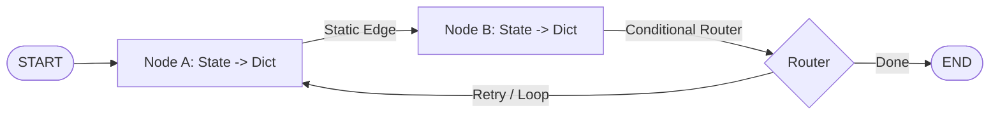
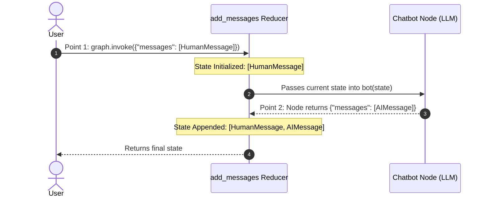
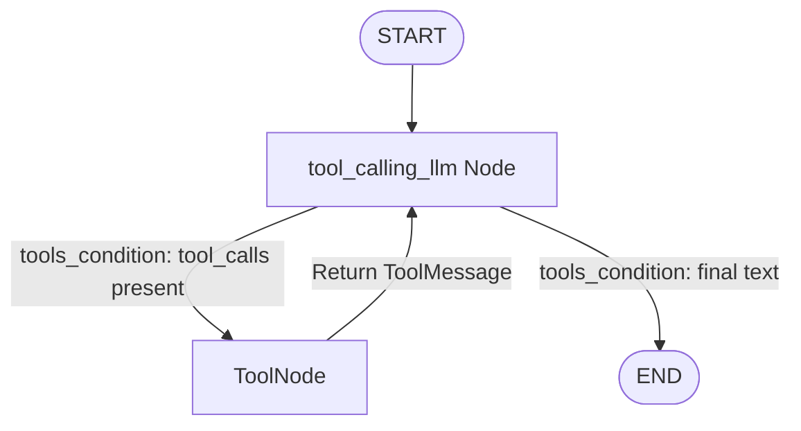
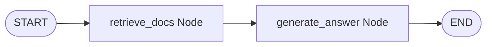
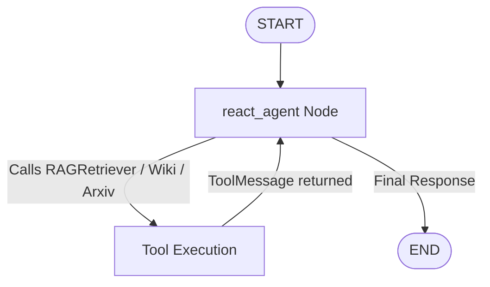
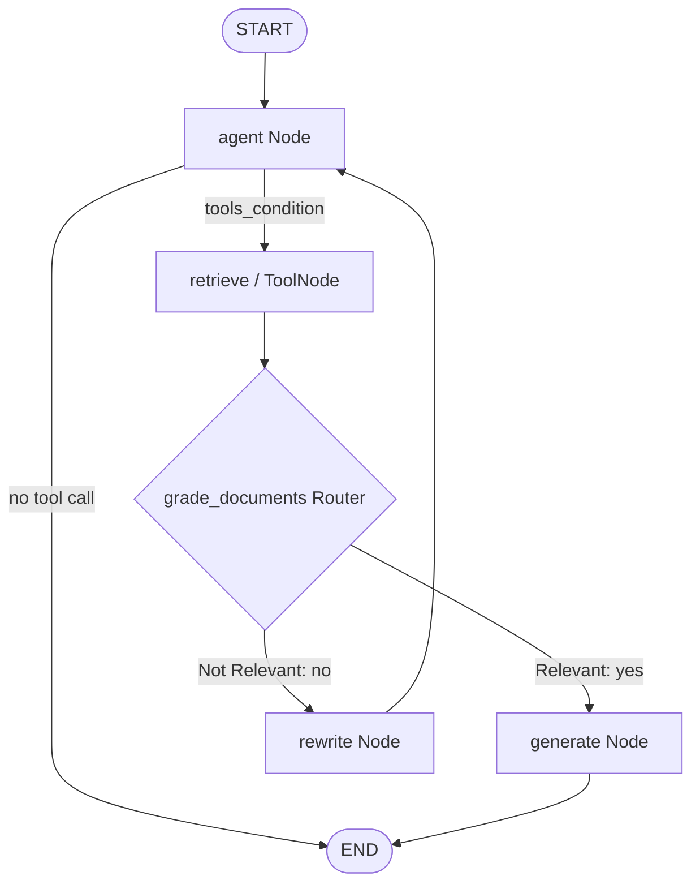
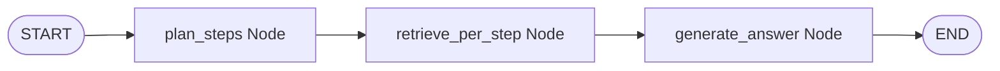

# LangGraph & Agentic RAG — Comprehensive Technical Study Guide & Production Reference

> **Target Audience:** Data Scientists, AI Engineers & System Architects  
> **Source Material:** All 13 Notebooks across `Langgraph_basics/`, `agent_architecture/`, `agentic_rag/`, and `autonomus rag/`  
> **Style:** High-density, precise theory, clear mental models, step-by-step lifecycles, and production-ready code implementations.

---

## 📑 Table of Contents
1. [Core Mental Model & Concepts](#1-core-mental-model--concepts)
2. [Master API Reference: General Syntax & 1-Line Theory](#2-master-api-reference-general-syntax--1-line-theory)
3. [Module 1: Basic Graph Construction & Routing (`1-simplegraph.ipynb`)](#3-module-1-basic-graph-construction--routing-1-simplegraphipynb)
4. [Module 2: Conversational Chatbots & State Reducers (`2-chatbot.ipynb`)](#4-module-2-conversational-chatbots--state-reducers-2-chatbotipynb)
   - [Why Reducers are Required](#why-reducers-are-required)
   - [Crucial Distinction: Standalone `add_messages()` vs Graph Reducer](#crucial-distinction-standalone-add_messages-vs-graph-reducer)
   - [The 2-Point State Update Lifecycle](#the-2-point-state-update-lifecycle)
5. [Module 3: State Schemas — `TypedDict` vs `@dataclass` (`3-DataclassStateSchema.ipynb`)](#5-module-3-state-schemas--typeddict-vs-dataclass-3-dataclassstateschemaipynb)
6. [Module 4: Runtime Validation with Pydantic (`4-pydantic.ipynb`)](#6-module-4-runtime-validation-with-pydantic-4-pydanticipynb)
7. [Module 5 & 6: Autonomous Agents & Tool Calling (ReAct Loop)](#7-module-5--6-autonomous-agents--tool-calling-react-loop)
   - [The 4 Core Message Types](#the-4-core-message-types)
   - [Anatomy of a Tool-Calling Message History](#anatomy-of-a-tool-calling-message-history)
   - [Production Shortcut: `create_react_agent`](#production-shortcut-create_react_agent)
8. [Module 8: Summary Comparison Matrix & Best Practices](#8-module-8-summary-comparison-matrix--best-practices)
9. [Module 9: ReAct Architecture, Tool Binding & Checkpointer Memory (`agent_architecture/1-react_agent_architecture.ipynb`)](#9-module-9-react-architecture-tool-binding--checkpointer-memory-agent_architecture1-react_agent_architectureipynb)
10. [Module 10: Streaming Modes & Token Event Handling (`agent_architecture/2-streaming_and_token_events.ipynb`)](#10-module-10-streaming-modes--token-event-handling-agent_architecture2-streaming_and_token_eventsipynb)
11. [Module 11: Foundational Agentic RAG Workflows (`agentic_rag/1-agentic_rag_workflow.ipynb`)](#11-module-11-foundational-agentic-rag-workflows-agentic_rag1-agentic_rag_workflowipynb)
12. [Module 12: ReAct Agentic RAG & Multi-Tool Retrieval (`agentic_rag/2-react_agentic_rag.ipynb`)](#12-module-12-react-agentic-rag--multi-tool-retrieval-agentic_rag2-react_agentic_ragipynb)
13. [Module 13: Advanced Self-Correcting Agentic RAG (`agentic_rag/3-langgraph_agent_quickstart.ipynb`)](#13-module-13-advanced-self-correcting-agentic-rag-agentic_rag3-langgraph_agent_quickstartipynb)
14. [Module 14: Chain-of-Thought (CoT) Multi-Step RAG (`autonomus rag/3-COTRag.ipynb`)](#14-module-14-chain-of-thought-cot-multi-step-rag-autonomus-rag3-cotragipynb)

---

## 1. Core Mental Model & Concepts

- **The Analogy (Shared Clipboard):** Think of LangGraph as a workshop where specialist workers (**Nodes**) take turns reading from and writing to a central shared clipboard (**State**), moving from desk to desk along supervisor paths (**Edges**).
- **Cyclic vs Linear (DAG):** Traditional chains only run forward in one pass. LangGraph supports **cycles and loops**, enabling agents to reason, call tools, inspect results, correct errors, and try again.
- **START & END:** Built-in virtual boundary nodes indicating where execution enters and exits the graph.
- **Compile:** Validates the topological graph builder (`StateGraph`) and produces an executable, runnable `CompiledGraph`.



---

## 2. Master API Reference: General Syntax & 1-Line Theory

| API Component | 1-Line Theory | General Syntax Signature |
| :--- | :--- | :--- |
| **`StateGraph(Schema)`** | Initializes graph blueprint using a specified state schema. | `builder = StateGraph(StateSchema)` |
| **`builder.add_node(name, fn)`** | Registers a worker function that accepts `state` and returns an update dict. | `builder.add_node("name", my_func)` |
| **`builder.add_edge(src, dst)`** | Creates a fixed, unconditional one-way transition between nodes. | `builder.add_edge("node_a", "node_b")` |
| **`builder.add_conditional_edges()`** | Dynamically branches execution based on a router function's return value. | `builder.add_conditional_edges("src", router_fn, path_map=None)` |
| **`tools_condition`** | Prebuilt router that checks for `tool_calls` in latest message; routes to `"tools"` or `END`. | `builder.add_conditional_edges("llm_node", tools_condition)` |
| **`ToolNode(tools)`** | Prebuilt node that executes tool calls from `AIMessage` and returns `ToolMessage`. | `builder.add_node("tools", ToolNode([tool1, tool2]))` |
| **`Annotated[list, add_messages]`** | Reducer annotation instructing LangGraph to **append** messages instead of overwriting. | `messages: Annotated[list[AnyMessage], add_messages]` |
| **`@tool`** | Decorator converting a Python function into an LLM-callable tool using docstrings & type hints. | `@tool\ndef my_tool(a: int) -> int:` |
| **`llm.bind_tools(tools)`** | Attaches tool JSON schemas to the model so it knows it can call them. | `llm_with_tools = llm.bind_tools([tool1, tool2])` |
| **`builder.compile(checkpointer)`** | Validates topology and produces an executable `CompiledGraph` with optional persistence. | `graph = builder.compile(checkpointer=memory)` |
| **`graph.invoke(input, config)`** | Synchronously runs the graph from `START` to `END` and returns final state. | `result = graph.invoke({"key": value}, config=config)` |
| **`graph.stream(input, mode)`** | Streams step-by-step state emissions (`"updates"` or `"values"`). | `for event in graph.stream(input, stream_mode="updates"):` |
| **`create_react_agent(llm, tools)`** | One-line factory constructor that builds a complete ReAct agent graph. | `agent = create_react_agent(llm, tools)` |

---

## 3. Module 1: Basic Graph Construction & Routing (`1-simplegraph.ipynb`)

### Core Rule: Default State Overwrite
Without a reducer, any dictionary returned by a node **completely replaces** that key's previous value in the state.

```python
from typing import TypedDict, Literal
import random
from langgraph.graph import StateGraph, START, END

# 1. State Schema
class State(TypedDict):
    graph_info: str

# 2. Worker Nodes (State in -> Dict out)
def start_play(state: State) -> dict:
    return {"graph_info": state['graph_info'] + " I am planning to play"}

def cricket(state: State) -> dict:
    return {"graph_info": state['graph_info'] + " Cricket"}

def badminton(state: State) -> dict:
    return {"graph_info": state['graph_info'] + " Badminton"}

# 3. Router Function (State in -> String node name out)
def random_play(state: State) -> Literal['cricket', 'badminton']:
    return "cricket" if random.random() > 0.5 else "badminton"

# 4. Assembly & Compilation
builder = StateGraph(State)
builder.add_node("start_play", start_play)
builder.add_node("cricket", cricket)
builder.add_node("badminton", badminton)

builder.add_edge(START, "start_play")
builder.add_conditional_edges("start_play", random_play)
builder.add_edge("cricket", END)
builder.add_edge("badminton", END)

graph = builder.compile()
res = graph.invoke({"graph_info": "Hey My name is Krish"})
print(res)
# Output: {'graph_info': 'Hey My name is Krish I am planning to play Cricket'}
```

---

## 4. Module 2: Conversational Chatbots & State Reducers (`2-chatbot.ipynb`)

### Why Reducers are Required
In a multi-turn chatbot, returning `{"messages": [new_reply]}` without a reducer wipes out all previous conversation history. A reducer tells LangGraph how to merge new data into existing data.

---

### Crucial Distinction: Standalone `add_messages()` vs Graph Reducer

1. **In Pure Python:** `add_messages(list1, new_msg)` is just a regular helper function that appends. Calling it directly in Python will always combine them regardless of `class State`.
2. **Inside LangGraph (`StateGraph`):** The schema definition controls engine behavior:
   - `messages: list[AnyMessage]` $\rightarrow$ **Overwrites** state with returned value.
   - `messages: Annotated[list[AnyMessage], add_messages]` $\rightarrow$ **Appends** returned value to existing state automatically.

#### Side-by-Side Code Proof & Outputs:

```python
from typing import Annotated, TypedDict
from langchain_core.messages import AnyMessage, HumanMessage, AIMessage
from langgraph.graph import StateGraph, START, END
from langgraph.graph.message import add_messages

# ❌ WITHOUT Reducer: LangGraph Overwrites History
class StateNoReducer(TypedDict):
    messages: list[AnyMessage]

def bot_no(state: StateNoReducer) -> dict:
    return {"messages": [AIMessage(content="I am fine!")]}

builder_no = StateGraph(StateNoReducer)
builder_no.add_node("bot", bot_no)
builder_no.add_edge(START, "bot")
builder_no.add_edge("bot", END)
graph_no = builder_no.compile()

res_no = graph_no.invoke({"messages": [HumanMessage(content="Hi"), HumanMessage(content="How are you?")]})
print(f"Total messages without reducer: {len(res_no['messages'])}")
# Output: 1 (The initial user messages were ERASED!)

# ✅ WITH Reducer: LangGraph Appends to History
class StateWithReducer(TypedDict):
    messages: Annotated[list[AnyMessage], add_messages]

def bot_with(state: StateWithReducer) -> dict:
    return {"messages": [AIMessage(content="I am fine!")]}

builder_with = StateGraph(StateWithReducer)
builder_with.add_node("bot", bot_with)
builder_with.add_edge(START, "bot")
builder_with.add_edge("bot", END)
graph_with = builder_with.compile()

res_with = graph_with.invoke({"messages": [HumanMessage(content="Hi"), HumanMessage(content="How are you?")]})
print(f"Total messages with reducer: {len(res_with['messages'])}")
# Output: 3 (Full conversation history preserved!)
```

---

### The 2-Point State Update Lifecycle



---

## 5. Module 3: State Schemas — `TypedDict` vs `@dataclass` (`3-DataclassStateSchema.ipynb`)

| Feature | `TypedDict` | `@dataclass` |
| :--- | :--- | :--- |
| **Field Access** | Dictionary key indexing: `state["name"]` | Dot notation: `state.name` |
| **Default Values** | Limited | Easy (`field: Optional[str] = None`) |
| **Input Flexibility** | Accepts dictionary | Accepts dataclass instance **or** plain dictionary |

```python
from dataclasses import dataclass
from typing import Optional, Literal
from langgraph.graph import StateGraph, START, END

@dataclass
class DataClassState:
    name: str
    game: Optional[Literal["cricket", "badminton"]] = None

def play_game(state: DataClassState) -> dict:
    return {"name": state.name + " wants to play"}

builder = StateGraph(DataClassState)
builder.add_node("play", play_game)
builder.add_edge(START, "play")
builder.add_edge("play", END)

graph = builder.compile()
print(graph.invoke(DataClassState(name="Krish")))
```

---

## 6. Module 4: Runtime Validation with Pydantic (`4-pydantic.ipynb`)

Neither `TypedDict` nor `@dataclass` validates types at runtime. In production APIs where models or external users pass untrusted input, **Pydantic `BaseModel`** guarantees data integrity.

```python
from pydantic import BaseModel, Field, ValidationError
from typing import Optional, Literal
from langgraph.graph import StateGraph, START, END

class UserState(BaseModel):
    name: str = Field(description="User name")
    age: int = Field(default=0, ge=0, description="Age must be >= 0")
    category: Optional[Literal["Junior", "Adult", "Senior"]] = None

def classify_age(state: UserState) -> dict:
    cat = "Junior" if state.age < 18 else "Adult" if state.age < 60 else "Senior"
    return {"category": cat}

builder = StateGraph(UserState)
builder.add_node("classify", classify_age)
builder.add_edge(START, "classify")
builder.add_edge("classify", END)

graph = builder.compile()

# Automatic Type Coercion: "25" -> 25
res = graph.invoke({"name": "Krish", "age": "25"})
print(res)  # category='Adult'
```

---

## 7. Module 5 & 6: Autonomous Agents & Tool Calling (ReAct Loop)

### The 4 Core Message Types
1. **`SystemMessage`:** Persona, behavior rules, and constraints.
2. **`HumanMessage`:** User prompt or query.
3. **`AIMessage`:** Model response. If calling tools, contains `tool_calls=[{'name': ..., 'args': ..., 'id': ...}]`.
4. **`ToolMessage`:** Output payload returned from executing a tool, keyed by `tool_call_id`.

---

### Anatomy of a Tool-Calling Message History

When asking `"What is 2 plus 2?"`, the message trace looks like this:

```text
1. HumanMessage : "What is 2 plus 2?"
2. AIMessage    : Tool Calls -> add(a=2, b=2), Call ID: "call_abc123"
3. ToolMessage  : Name: add, Content: "4", Tool Call ID: "call_abc123"
4. AIMessage    : "2 plus 2 is 4."
```

---

### Multi-Tool Assistants (Arxiv, Wikipedia & Safe Math)

```python
from typing import Annotated, TypedDict
from langchain_core.messages import AnyMessage, HumanMessage
from langchain_core.tools import tool
from langchain_community.tools import ArxivQueryRun, WikipediaQueryRun
from langchain_community.utilities import WikipediaAPIWrapper, ArxivAPIWrapper
from langchain_groq import ChatGroq
from langgraph.graph import StateGraph, START, END
from langgraph.graph.message import add_messages
from langgraph.prebuilt import ToolNode, tools_condition

# 1. Define Tools
@tool
def calculate_expression(expression: str) -> str:
    """Safely evaluates basic math expressions like '2 + 2' or '10 * 5'."""
    try:
        return str(eval(expression, {"__builtins__": None}, {}))
    except Exception as e:
        return f"Error: {e}"

arxiv = ArxivQueryRun(api_wrapper=ArxivAPIWrapper(top_k_results=1, doc_content_chars_max=400))
wiki = WikipediaQueryRun(api_wrapper=WikipediaAPIWrapper(top_k_results=1, doc_content_chars_max=400))
tools = [arxiv, wiki, calculate_expression]

# 2. LLM with Bound Tools
llm = ChatGroq(model="llama-3.3-70b-versatile")
llm_with_tools = llm.bind_tools(tools)

# 3. State Schema
class State(TypedDict):
    messages: Annotated[list[AnyMessage], add_messages]

# 4. LLM Node Function
def llm_tool(state: State) -> dict:
    return {"messages": [llm_with_tools.invoke(state["messages"])]}

# 5. Graph Assembly
builder = StateGraph(State)
builder.add_node("llm_tool", llm_tool)
builder.add_node("tools", ToolNode(tools))

builder.add_edge(START, "llm_tool")
builder.add_conditional_edges("llm_tool", tools_condition)
builder.add_edge("tools", "llm_tool")  # Loop back!

graph = builder.compile()
```

---

### Production Shortcut: `create_react_agent`

```python
from langgraph.prebuilt import create_react_agent

# Builds StateGraph + ToolNode + add_messages + tools_condition loop in one line
agent = create_react_agent(llm, tools)
res = agent.invoke({"messages": [HumanMessage(content="What is 15 * 8?")]})
print(res["messages"][-1].content)
```

---

## 8. Module 8: Summary Comparison Matrix & Best Practices

### State Schema Comparison Matrix

| Feature | `TypedDict` | `@dataclass` | `Pydantic BaseModel` |
| :--- | :--- | :--- | :--- |
| **Field Access** | `state["key"]` | `state.key` | `state.key` |
| **Runtime Validation** | ❌ None | ❌ None | ✅ Strict runtime checks |
| **Type Coercion** | ❌ No | ❌ No | ✅ Automatic (`"25"` $\rightarrow$ `25`) |
| **Field Constraints** | ❌ No | ❌ No | ✅ `Field(ge=0, regex=...)` |
| **Recommended Use** | Prototyping, simple chat | Clean OOP state structures | Production APIs & user inputs |

---

### Best Practices Checklist
- [x] **Always use `Annotated[..., add_messages]`** for message lists to avoid erasing conversation history.
- [x] **Always connect `"tools"` $\rightarrow$ `"llm_node"`** in ReAct graphs so the LLM can read tool outputs and generate a final response.
- [x] **Write explicit docstrings for `@tool` functions**: The LLM relies on them to decide when and how to call your tools.
- [x] **Sanitize custom evaluation tools**: Disable `__builtins__` when using `eval` to prevent code injection.

---

## 9. Module 9: ReAct Architecture, Tool Binding & Checkpointer Memory (`agent_architecture/1-react_agent_architecture.ipynb`)

### Core Concept & Mental Model
ReAct (**Reasoning + Acting**) allows LLMs to solve complex tasks by looping through three distinct phases:
1. **Act**: The model requests execution of specific external tools (Arxiv, Wikipedia, Tavily search, custom functions).
2. **Observe**: The environment/graph executes the tool and passes output back into state as a `ToolMessage`.
3. **Reason**: The model inspects the observation and decides whether to invoke another tool or return a final response to the user.



### Complete Code Implementation with Checkpointer Memory
```python
from typing import Annotated, TypedDict
from langchain_core.messages import AnyMessage, HumanMessage
from langchain_community.tools import ArxivQueryRun, WikipediaQueryRun, TavilySearchResults
from langchain_community.utilities import ArxivAPIWrapper, WikipediaAPIWrapper
from langchain_groq import ChatGroq
from langgraph.graph import StateGraph, START, END
from langgraph.graph.message import add_messages
from langgraph.prebuilt import ToolNode, tools_condition
from langgraph.checkpoint.memory import MemorySaver

# 1. Define Tools
def multiply(a: int, b: int) -> int:
    """Multiply a and b."""
    return a * b

def add(a: int, b: int) -> int:
    """Adds a and b."""
    return a + b

def divide(a: int, b: int) -> float:
    """Divide a and b."""
    return a / b

arxiv = ArxivQueryRun(api_wrapper=ArxivAPIWrapper(top_k_results=2, doc_content_chars_max=500))
wiki = WikipediaQueryRun(api_wrapper=WikipediaAPIWrapper(top_k_results=1, doc_content_chars_max=500))
tavily = TavilySearchResults()
tools = [arxiv, wiki, tavily, add, divide, multiply]

# 2. LLM with Bound Tools & State Schema
llm = ChatGroq(model="qwen-qwq-32b")
llm_with_tools = llm.bind_tools(tools)

class State(TypedDict):
    messages: Annotated[list[AnyMessage], add_messages]

def tool_calling_llm(state: State) -> dict:
    return {"messages": [llm_with_tools.invoke(state["messages"])]}

# 3. Assemble Graph with Checkpointer Memory
builder = StateGraph(State)
builder.add_node("tool_calling_llm", tool_calling_llm)
builder.add_node("tools", ToolNode(tools))

builder.add_edge(START, "tool_calling_llm")
builder.add_conditional_edges("tool_calling_llm", tools_condition)
builder.add_edge("tools", "tool_calling_llm")

memory = MemorySaver()
graph_memory = builder.compile(checkpointer=memory)

# 4. Multi-Turn Thread Execution
config = {"configurable": {"thread_id": "1"}}
res1 = graph_memory.invoke({"messages": [HumanMessage(content="Add 12 and 13.")]}, config=config)
res2 = graph_memory.invoke({"messages": [HumanMessage(content="Add that number to 25.")]}, config=config)
print(res2["messages"][-1].content)  # Remembers history: 25 + 25 = 50
```

---

## 10. Module 10: Streaming Modes & Token Event Handling (`agent_architecture/2-streaming_and_token_events.ipynb`)

### Streaming Modes Comparison

| Stream Mode / API | Description | Output Payload Format |
| :--- | :--- | :--- |
| **`stream_mode="updates"`** | Streams *only* the state diff/delta emitted by each specific node as it finishes. | `{'SuperBot': {'messages': [AIMessage(...)]}}` |
| **`stream_mode="values"`** | Streams the *full consolidated state* snapshot after every node execution. | `{'messages': [HumanMessage(...), AIMessage(...)]}` |
| **`astream_events(..., version="v2")`** | Async stream emitting granular execution events (node entry, token generation, tool start/end). | Event dictionary containing `event`, `name`, `data`, and `metadata`. |

### Complete Code Implementation
```python
import asyncio
from typing import Annotated, TypedDict
from langchain_core.messages import AnyMessage, HumanMessage
from langchain_openai import ChatOpenAI
from langgraph.graph import StateGraph, START, END
from langgraph.graph.message import add_messages
from langgraph.checkpoint.memory import MemorySaver

class State(TypedDict):
    messages: Annotated[list[AnyMessage], add_messages]

llm = ChatOpenAI(model="gpt-4o")

def bot_node(state: State) -> dict:
    return {"messages": [llm.invoke(state["messages"])]}

builder = StateGraph(State)
builder.add_node("bot", bot_node)
builder.add_edge(START, "bot")
builder.add_edge("bot", END)

memory = MemorySaver()
graph = builder.compile(checkpointer=memory)
config = {"configurable": {"thread_id": "3"}}

# 1. Updates Mode (emits node diffs)
print("--- UPDATES MODE ---")
for chunk in graph.stream({"messages": [HumanMessage(content="I like cricket")]}, config, stream_mode="updates"):
    print(chunk)

# 2. Values Mode (emits full state snapshot)
print("--- VALUES MODE ---")
for state_snap in graph.stream({"messages": [HumanMessage(content="I also like football")]}, config, stream_mode="values"):
    print("Messages in snapshot:", len(state_snap["messages"]))

# 3. Asynchronous Token Streaming
async def stream_tokens():
    print("--- ASTREAM_EVENTS TOKEN STREAMING ---")
    async for event in graph.astream_events({"messages": [HumanMessage(content="Tell me a joke")]}, config, version="v2"):
        if event["event"] == "on_chat_model_stream":
            token = event["data"]["chunk"].content
            if token:
                print(token, end="", flush=True)

# asyncio.run(stream_tokens())
```

---

## 11. Module 11: Foundational Agentic RAG Workflows (`agentic_rag/1-agentic_rag_workflow.ipynb`)

### Architecture Overview
Traditional RAG is linear (`Query -> Retrieve -> Generate`). **Agentic RAG** encapsulates retrieval and document processing inside graph nodes, using explicit Pydantic or TypedDict state schemas to govern flow.



### Complete Code Implementation
```python
from pydantic import BaseModel
from typing import List
from langchain_community.document_loaders import WebBaseLoader
from langchain_text_splitters import RecursiveCharacterTextSplitter
from langchain_openai import OpenAIEmbeddings, ChatOpenAI
from langchain_community.vectorstores import FAISS
from langgraph.graph import StateGraph, START, END

# 1. Prepare Vectorstore Retriever
docs = WebBaseLoader("https://lilianweng.github.io/posts/2023-06-23-agent/").load()
chunks = RecursiveCharacterTextSplitter(chunk_size=500, chunk_overlap=50).split_documents(docs)
vectorstore = FAISS.from_documents(chunks, OpenAIEmbeddings())
retriever = vectorstore.as_retriever()
llm = ChatOpenAI(model="gpt-4o")

# 2. Define Pydantic State Schema
class RAGState(BaseModel):
    question: str
    retrieved_docs: List[str] = []
    answer: str = ""

# 3. Define Graph Nodes
def retrieve_docs(state: RAGState) -> RAGState:
    results = retriever.invoke(state.question)
    doc_texts = [d.page_content for d in results]
    return state.model_copy(update={"retrieved_docs": doc_texts})

def generate_answer(state: RAGState) -> RAGState:
    context = "\n\n".join(state.retrieved_docs)
    prompt = f"Question: {state.question}\nContext:\n{context}\nAnswer:"
    res = llm.invoke(prompt).content
    return state.model_copy(update={"answer": res})

# 4. Graph Assembly
builder = StateGraph(RAGState)
builder.add_node("retrieve", retrieve_docs)
builder.add_node("generate", generate_answer)
builder.add_edge(START, "retrieve")
builder.add_edge("retrieve", "generate")
builder.add_edge("generate", END)

graph = builder.compile()
final_state = graph.invoke(RAGState(question="What are autonomous agents?"))
print("Final Answer:\n", final_state["answer"])
```

---

## 12. Module 12: ReAct Agentic RAG & Multi-Tool Retrieval (`agentic_rag/2-react_agentic_rag.ipynb`)

### Concept & ReAct RAG Integration
Instead of hardcoding fixed retrieval steps, ReAct Agentic RAG encapsulates retrievers inside standard `Tool` abstractions. The LLM autonomously chooses when to call vectorstores versus external tools (Wikipedia, Arxiv).



### Complete Code Implementation with Tool Factory
```python
from typing import Annotated, Sequence, TypedDict
from langchain_core.tools import Tool
from langchain_core.messages import BaseMessage, HumanMessage
from langchain_community.document_loaders import TextLoader
from langchain_text_splitters import RecursiveCharacterTextSplitter
from langchain_community.vectorstores import FAISS
from langchain_openai import OpenAIEmbeddings, ChatOpenAI
from langchain_community.tools import WikipediaQueryRun
from langchain_community.utilities import WikipediaAPIWrapper
from langgraph.prebuilt import create_react_agent
from langgraph.graph import StateGraph, START, END
from langgraph.graph.message import add_messages

llm = ChatOpenAI(model="gpt-4o")

# 1. Custom Retriever Tool Factory Function
def make_retriever_tool_from_text(file_path: str, tool_name: str, description: str) -> Tool:
    docs = TextLoader(file_path, encoding="utf-8").load()
    chunks = RecursiveCharacterTextSplitter(chunk_size=500, chunk_overlap=50).split_documents(docs)
    vs = FAISS.from_documents(chunks, OpenAIEmbeddings())
    retriever = vs.as_retriever()

    def tool_func(query: str) -> str:
        results = retriever.invoke(query)
        return "\n\n".join(doc.page_content for doc in results)

    return Tool(name=tool_name, description=description, func=tool_func)

# 2. Provision Tools
wiki_tool = Tool(
    name="Wikipedia",
    description="Use this tool to fetch general world knowledge.",
    func=WikipediaQueryRun(api_wrapper=WikipediaAPIWrapper())
)
internal_tool_1 = make_retriever_tool_from_text("internal_docs.txt", "InternalTechDocs", "Search proprietary architecture docs.")
internal_tool_2 = make_retriever_tool_from_text("research_notes.txt", "InternalResearchNotes", "Search internal research notes.")

tools = [wiki_tool, internal_tool_1, internal_tool_2]

# 3. Create Native ReAct Node
react_node = create_react_agent(llm, tools)

# 4. State & Graph Definition
class AgentState(TypedDict):
    messages: Annotated[Sequence[BaseMessage], add_messages]

builder = StateGraph(AgentState)
builder.add_node("agentic_rag", react_node)
builder.add_edge(START, "agentic_rag")
builder.add_edge("agentic_rag", END)

graph = builder.compile()
res = graph.invoke({"messages": [HumanMessage(content="What do our internal research notes say about transformer variants?")]})
print("Final Answer:\n", res["messages"][-1].content)
```

---

## 13. Module 13: Advanced Self-Correcting Agentic RAG (`agentic_rag/3-langgraph_agent_quickstart.ipynb`)

### Cyclic Self-Correction Architecture
Advanced Agentic RAG evaluates retrieved document quality and automatically re-writes queries if retrieved documents are deemed irrelevant by a grader LLM.



### Complete Code Implementation
```python
from typing import Annotated, Sequence, TypedDict
from pydantic import BaseModel, Field
from langchain_core.messages import BaseMessage, HumanMessage
from langchain_core.prompts import PromptTemplate
from langchain_core.output_parsers import StrOutputParser
from langchain_groq import ChatGroq
from langgraph.graph import StateGraph, START, END
from langgraph.prebuilt import ToolNode, tools_condition
from langgraph.graph.message import add_messages

# 1. State Schema
class AgentState(TypedDict):
    messages: Annotated[Sequence[BaseMessage], add_messages]

# 2. Pydantic Document Grader Model
class GradeDocuments(BaseModel):
    binary_score: str = Field(description="Documents are relevant to the question, 'yes' or 'no'")

llm = ChatGroq(model="qwen-qwq-32b")
grader_llm = llm.with_structured_output(GradeDocuments)

# 3. Document Grading Router Function
def grade_documents(state: AgentState) -> str:
    messages = state["messages"]
    question = messages[0].content
    docs = messages[-1].content

    prompt = PromptTemplate(
        template="Grade document relevance to question.\nDocs: {context}\nQuestion: {question}\nScore 'yes' or 'no'.",
        input_variables=["context", "question"]
    )
    chain = prompt | grader_llm
    result = chain.invoke({"question": question, "context": docs})

    if result.binary_score.lower() == "yes":
        print("---DECISION: DOCS RELEVANT---")
        return "generate"
    else:
        print("---DECISION: DOCS NOT RELEVANT -> REWRITE QUERY---")
        return "rewrite"

# 4. Worker Nodes
def agent_node(state: AgentState) -> dict:
    return {"messages": [llm.invoke(state["messages"])]}

def rewrite_node(state: AgentState) -> dict:
    question = state["messages"][0].content
    msg = [HumanMessage(content=f"Formulate an improved, semantically rich search query for: {question}")]
    response = llm.invoke(msg)
    return {"messages": [response]}

def generate_node(state: AgentState) -> dict:
    question = state["messages"][0].content
    docs = state["messages"][-1].content
    prompt = f"Question: {question}\nContext:\n{docs}\nAnswer:"
    res = llm.invoke(prompt).content
    return {"messages": [res]}

# 5. Graph Assembly
workflow = StateGraph(AgentState)
workflow.add_node("agent", agent_node)
workflow.add_node("retrieve", ToolNode([retriever_tool]))
workflow.add_node("rewrite", rewrite_node)
workflow.add_node("generate", generate_node)

workflow.add_edge(START, "agent")
workflow.add_conditional_edges("agent", tools_condition, {"tools": "retrieve", END: END})
workflow.add_conditional_edges("retrieve", grade_documents)
workflow.add_edge("generate", END)
workflow.add_edge("rewrite", "agent")  # Cyclic loop back!

graph = workflow.compile()
```

---

## 14. Module 14: Chain-of-Thought (CoT) Multi-Step RAG (`autonomus rag/3-COTRag.ipynb`)

### Concept & Mental Model
Complex questions often fail in single-shot RAG because a single search query cannot cover multiple sub-questions. **Chain-of-Thought (CoT) RAG** decomposes complex queries into intermediate reasoning steps, retrieves documents for each sub-question, and synthesizes a well-reasoned answer.



### Complete Code Implementation
```python
from pydantic import BaseModel
from typing import List
from langchain.schema import Document
from langchain_openai import OpenAIEmbeddings, ChatOpenAI
from langchain_community.document_loaders import TextLoader
from langchain_text_splitters import RecursiveCharacterTextSplitter
from langchain_community.vectorstores import FAISS
from langgraph.graph import StateGraph, END

# 1. Prepare Vectorstore Retriever
docs = TextLoader("research_notes.txt", encoding="utf-8").load()
chunks = RecursiveCharacterTextSplitter(chunk_size=500, chunk_overlap=50).split_documents(docs)
vectorstore = FAISS.from_documents(chunks, OpenAIEmbeddings())
retriever = vectorstore.as_retriever()
llm = ChatOpenAI(model="gpt-4o")

# 2. Pydantic State Schema
class RAGCoTState(BaseModel):
    question: str
    sub_steps: List[str] = []
    retrieved_docs: List[Document] = []
    answer: str = ""

# 3. Step 1: Query Planner Node
def plan_steps(state: RAGCoTState) -> RAGCoTState:
    prompt = f"Break the question into 2-3 reasoning sub-questions:\n\n{state.question}"
    result = llm.invoke(prompt).content
    subqs = [line.strip("- ") for line in result.split("\n") if line.strip()]
    return state.model_copy(update={"sub_steps": subqs})

# 4. Step 2: Multi-Step Sub-Query Retriever Node
def retrieve_per_step(state: RAGCoTState) -> RAGCoTState:
    all_docs = []
    for sub in state.sub_steps:
        docs = retriever.invoke(sub)
        all_docs.extend(docs)
    return state.model_copy(update={"retrieved_docs": all_docs})

# 5. Step 3: Final Answer Synthesizer Node
def generate_answer(state: RAGCoTState) -> RAGCoTState:
    context = "\n\n".join([doc.page_content for doc in state.retrieved_docs])
    prompt = f"""
You are answering a complex question using reasoning and retrieved documents.

Question: {state.question}

Relevant Information:
{context}

Synthesize a well-reasoned final answer.
"""
    result = llm.invoke(prompt).content.strip()
    return state.model_copy(update={"answer": result})

# 6. Assemble Linear CoT Pipeline
builder = StateGraph(RAGCoTState)
builder.add_node("planner", plan_steps)
builder.add_node("retriever", retrieve_per_step)
builder.add_node("responder", generate_answer)

builder.set_entry_point("planner")
builder.add_edge("planner", "retriever")
builder.add_edge("retriever", "responder")
builder.add_edge("responder", END)

graph = builder.compile()
final = graph.invoke(RAGCoTState(question="What are the additional experiments in Transformer evaluation?"))
print("Reasoning Steps:", final["sub_steps"])
print("\nFinal Answer:\n", final["answer"])
```
