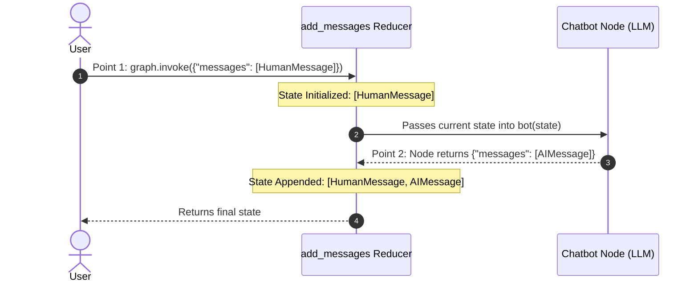
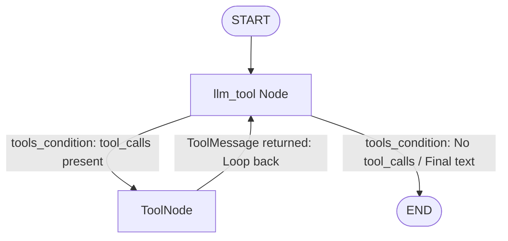

# LangGraph Fundamentals — The Complete Technical Study Guide

> **Target Audience:** Data Scientists & AI Engineers  
> **Source Material:** `Langgraph_basics/` Notebooks (`1-simplegraph.ipynb` $\rightarrow$ `6-chatbotswithmultipletools.ipynb`)  
> **Style:** High-density, precise theory, clear mental models, and practical code patterns.

---

## 📑 Table of Contents
1. [Core Mental Model & Concepts](#1-core-mental-model--concepts)
2. [Master API Reference: General Syntax & 1-Line Theory](#2-master-api-reference-general-syntax--1-line-theory)
3. [Module 1: Basic Graph Construction & Routing (`1-simplegraph.ipynb`)](#3-module-1-basic-graph-construction--routing-1-simplegraphipynb)
4. [Module 2: Conversational Chatbots & State Reducers (`2-chatbot.ipynb`)](#4-module-2-conversational-chatbots--state-reducers-2-chatbotipynb)
   - [Why Reducers are Required](#why-reducers-are-required)
   - [Crucial Distinction: Standalone `add_messages()` vs Graph Reducer](#crucial-distinction-standalone-add_messages-vs-graph-reducer)
   - [The 2-Point State Update Lifecycle](#the-2-point-state-update-lifecycle)
   - [Streaming Modes: `updates` vs `values`](#streaming-modes-updates-vs-values)
5. [Module 3: State Schemas — `TypedDict` vs `@dataclass` (`3-DataclassStateSchema.ipynb`)](#5-module-3-state-schemas--typeddict-vs-dataclass-3-dataclassstateschemaipynb)
6. [Module 4: Runtime Validation with Pydantic (`4-pydantic.ipynb`)](#6-module-4-runtime-validation-with-pydantic-4-pydanticipynb)
7. [Module 5 & 6: Autonomous Agents & Tool Calling (ReAct Loop)](#7-module-5--6-autonomous-agents--tool-calling-react-loop)
   - [The 4 Core Message Types](#the-4-core-message-types)
   - [Anatomy of a Tool-Calling Message History](#anatomy-of-a-tool-calling-message-history)
   - [ReAct Architecture & Execution Trace](#react-architecture--execution-trace)
   - [Deep Dives & FAQs (Collapsible Details)](#deep-dives--faqs)
   - [Multi-Tool Assistants (Arxiv, Wikipedia & Safe Math)](#multi-tool-assistants-arxiv-wikipedia--safe-math)
   - [Production Shortcut: `create_react_agent`](#production-shortcut-create_react_agent)
8. [Summary Comparison Matrix & Best Practices](#8-summary-comparison-matrix--best-practices)

---

## 1. Core Mental Model & Concepts

- **The Analogy (Shared Clipboard):** Think of LangGraph as a workshop where specialist workers (**Nodes**) take turns reading from and writing to a central shared clipboard (**State**), moving from desk to desk along supervisor paths (**Edges**).
- **Cyclic vs Linear (DAG):** Traditional chains only run forward in one pass. LangGraph supports **cycles and loops**, enabling agents to reason, call tools, inspect results, correct errors, and try again.
- **START & END:** Built-in virtual boundary nodes indicating where execution enters and exits.
- **Compile:** Validates the topological graph and builds a runnable `CompiledGraph`.


---

## 2. Master API Reference: General Syntax & 1-Line Theory

| API Component | 1-Line Theory | General Syntax Signature |
| :--- | :--- | :--- |
| **`StateGraph(Schema)`** | Initializes graph blueprint using a specified state schema. | `builder = StateGraph(StateSchema)` |
| **`builder.add_node(name, fn)`** | Registers a worker function that accepts `state` and returns update dict. | `builder.add_node("name", my_func)` |
| **`builder.add_edge(src, dst)`** | Creates a fixed, unconditional one-way transition between nodes. | `builder.add_edge("node_a", "node_b")` |
| **`builder.add_conditional_edges()`** | Dynamically branches execution based on a router function's return value. | `builder.add_conditional_edges("src", router_fn, path_map=None)` |
| **`tools_condition`** | Prebuilt router that checks for `tool_calls` in latest message; routes to `"tools"` or `END`. | `builder.add_conditional_edges("llm_node", tools_condition)` |
| **`ToolNode(tools)`** | Prebuilt node that executes tool calls from `AIMessage` and returns `ToolMessage`. | `builder.add_node("tools", ToolNode([tool1, tool2]))` |
| **`Annotated[list, add_messages]`** | Reducer annotation instructing LangGraph to **append** messages instead of overwriting. | `messages: Annotated[list[AnyMessage], add_messages]` |
| **`@tool`** | Decorator converting a Python function into an LLM-callable tool using docstrings & type hints. | `@tool\ndef my_tool(a: int) -> int:` |
| **`llm.bind_tools(tools)`** | Attaches tool JSON schemas to the model so it knows it can call them. | `llm_with_tools = llm.bind_tools([tool1, tool2])` |
| **`builder.compile()`** | Validates the graph topology and produces a runnable `CompiledGraph`. | `graph = builder.compile()` |
| **`graph.invoke(input)`** | Synchronously runs the graph from `START` to `END` and returns final state. | `result = graph.invoke({"key": value})` |
| **`graph.stream(input, mode)`** | Streams step-by-step state emissions (`"updates"` or `"values"`). | `for event in graph.stream(input, stream_mode="updates"):` |
| **`create_react_agent(llm, tools)`** | One-line factory constructor that builds a complete ReAct agent graph. | `agent = create_react_agent(llm, tools)` |

---

## 3. Module 1: Basic Graph Construction & Routing (`1-simplegraph.ipynb`)

### Core Rule: Default State Overwrite
Without a reducer, any dictionary returned by a node **completely replaces** that key's previous value in the state.

```python
from typing import TypedDict, Literal
import random
from langgraph.graph import StateGraph, START, END

# 1. State Schema
class State(TypedDict):
    graph_info: str

# 2. Worker Nodes (State in -> Dict out)
def start_play(state: State) -> dict:
    return {"graph_info": state['graph_info'] + " I am planning to play"}

def cricket(state: State) -> dict:
    return {"graph_info": state['graph_info'] + " Cricket"}

def badminton(state: State) -> dict:
    return {"graph_info": state['graph_info'] + " Badminton"}

# 3. Router Function (State in -> String node name out)
def random_play(state: State) -> Literal['cricket', 'badminton']:
    return "cricket" if random.random() > 0.5 else "badminton"

# 4. Assembly & Compilation
builder = StateGraph(State)
builder.add_node("start_play", start_play)
builder.add_node("cricket", cricket)
builder.add_node("badminton", badminton)

builder.add_edge(START, "start_play")
builder.add_conditional_edges("start_play", random_play)
builder.add_edge("cricket", END)
builder.add_edge("badminton", END)

graph = builder.compile()
res = graph.invoke({"graph_info": "Hey My name is Krish"})
print(res)
# Output: {'graph_info': 'Hey My name is Krish I am planning to play Cricket'}
```

---

## 4. Module 2: Conversational Chatbots & State Reducers (`2-chatbot.ipynb`)

### Why Reducers are Required
In a multi-turn chatbot, returning `{"messages": [new_reply]}` without a reducer wipes out all previous conversation history. A reducer tells LangGraph how to merge new data into existing data.

---

### Crucial Distinction: Standalone `add_messages()` vs Graph Reducer

1. **In Pure Python:** `add_messages(list1, new_msg)` is just a regular helper function that appends. Calling it directly in Python will always combine them regardless of `class State`.
2. **Inside LangGraph (`StateGraph`):** The schema definition controls engine behavior:
   - `messages: list[AnyMessage]` $\rightarrow$ **Overwrites** state with returned value.
   - `messages: Annotated[list[AnyMessage], add_messages]` $\rightarrow$ **Appends** returned value to existing state automatically.

#### Side-by-Side Code Proof & Outputs:

```python
# ❌ WITHOUT Reducer: LangGraph Overwrites History
class StateNoReducer(TypedDict):
    messages: list[AnyMessage]

def bot(state: StateNoReducer) -> dict:
    return {"messages": [AIMessage("I am fine!")]}

builder = StateGraph(StateNoReducer)
builder.add_node("bot", bot); builder.add_edge(START, "bot"); builder.add_edge("bot", END)
graph_no = builder.compile()

res_no = graph_no.invoke({"messages": [HumanMessage("Hi"), HumanMessage("How are you?")]})

print(f"Total messages: {len(res_no['messages'])}")
for m in res_no["messages"]: print(f" - {m.content}")
```
**Output:**
```text
Total messages: 1
 - I am fine!
(💥 The 2 initial user messages were completely ERASED and overwritten!)
```

```python
# ✅ WITH Reducer: LangGraph Appends to History
class StateWithReducer(TypedDict):
    messages: Annotated[list[AnyMessage], add_messages]

def bot(state: StateWithReducer) -> dict:
    return {"messages": [AIMessage("I am fine!")]}

builder = StateGraph(StateWithReducer)
builder.add_node("bot", bot); builder.add_edge(START, "bot"); builder.add_edge("bot", END)
graph_with = builder.compile()

res_with = graph_with.invoke({"messages": [HumanMessage("Hi"), HumanMessage("How are you?")]})

print(f"Total messages: {len(res_with['messages'])}")
for m in res_with["messages"]: print(f" - {m.content}")
```
**Output:**
```text
Total messages: 3
 - Hi
 - How are you?
 - I am fine!
(🎉 Full conversation history preserved because add_messages appended the new reply!)
```

---

### The 2-Point State Update Lifecycle



---

### Streaming Modes: `updates` vs `values`

```python
# 1. updates: Emits only what changed in each specific node
for event in graph.stream({"messages": [HumanMessage("Hi")]}, stream_mode="updates"):
    print(event) # {'bot': {'messages': [AIMessage(...)]}}

# 2. values: Emits the full consolidated state snapshot after each step
for state in graph.stream({"messages": [HumanMessage("Hi")]}, stream_mode="values"):
    print(len(state["messages"]))
```

---

## 5. Module 3: State Schemas — `TypedDict` vs `@dataclass` (`3-DataclassStateSchema.ipynb`)

| Feature | `TypedDict` | `@dataclass` |
| :--- | :--- | :--- |
| **Field Access** | Dictionary key indexing: `state["name"]` | Dot notation: `state.name` |
| **Default Values** | Limited | Easy (`field: Optional[str] = None`) |
| **Input Flexibility** | Accepts dictionary | Accepts dataclass instance **or** plain dictionary |

```python
from dataclasses import dataclass
from typing import Optional, Literal

@dataclass
class DataClassState:
    name: str
    game: Optional[Literal["cricket", "badminton"]] = None

def play_game(state: DataClassState) -> dict:
    return {"name": state.name + " wants to play"}
```

---

## 6. Module 4: Runtime Validation with Pydantic (`4-pydantic.ipynb`)

Neither `TypedDict` nor `@dataclass` validates types at runtime. In production APIs where models or external users pass untrusted input, **Pydantic `BaseModel`** guarantees data integrity.

```python
from pydantic import BaseModel, Field, ValidationError
from typing import Optional, Literal

class UserState(BaseModel):
    name: str = Field(description="User name")
    age: int = Field(default=0, ge=0, description="Age must be >= 0")
    category: Optional[Literal["Junior", "Adult", "Senior"]] = None

def classify_age(state: UserState) -> dict:
    cat = "Junior" if state.age < 18 else "Adult" if state.age < 60 else "Senior"
    return {"category": cat}
```

- **Automatic Type Coercion:** Passing `{"name": "Krish", "age": "25"}` safely converts string `"25"` to integer `25`.
- **Validation Failure:** Passing `{"age": -5}` or `{"age": "abc"}` immediately raises a `pydantic.ValidationError`.

---

## 7. Module 5 & 6: Autonomous Agents & Tool Calling (ReAct Loop)

### The 4 Core Message Types
1. **`SystemMessage`:** Persona, behavior rules, and constraints.
2. **`HumanMessage`:** User prompt or query.
3. **`AIMessage`:** Model response. If calling tools, contains `tool_calls=[{'name': ..., 'args': ..., 'id': ...}]`.
4. **`ToolMessage`:** Output payload returned from executing a tool, keyed by `tool_call_id`.

---

### Anatomy of a Tool-Calling Message History

When asking `"What is 2 plus 2?"`, the message trace looks like this:

```text
1. HumanMessage : "What is 2 plus 2?"
2. AIMessage    : Tool Calls -> add(a=2, b=2), Call ID: "call_abc123"
3. ToolMessage  : Name: add, Content: "4", Tool Call ID: "call_abc123"
4. AIMessage    : "2 plus 2 is 4."
```

> **Which line generates the `ToolMessage`?**  
> `builder.add_node("tools", ToolNode(tools))`  
> `ToolNode` reads the `AIMessage.tool_calls`, executes `add(a=2, b=2)`, and wraps result `4` into `ToolMessage(name="add", content="4", tool_call_id="call_abc123")`.

---

### ReAct Architecture & Execution Trace



---

### Deep Dives & FAQs

<details>
<summary>🔍 <b>Deep Dive: How <code>tools_condition</code> Decides Where to Route</b></summary>

`tools_condition` is a built-in router function that inspects the latest message in `state["messages"]`:

```python
def tools_condition(state: State) -> str:
    last_message = state["messages"][-1]
    # If the LLM requested a tool call, route to the node named "tools"
    if hasattr(last_message, "tool_calls") and len(last_message.tool_calls) > 0:
        return "tools"
    # Otherwise, finish execution
    return "__end__"
```

**Key Distinction:**
- **The LLM:** Decides *which* tool to call (e.g. `add(2, 2)`) and attaches arguments.
- **`tools_condition`:** Only acts as a traffic router (returns `"tools"` or `"__end__"`).
- **`ToolNode`:** Actually matches the tool name and *executes* the Python function.
</details>

<details>
<summary>❓ <b>FAQ: Does the Node Name ALWAYS Have to Be <code>"tools"</code>?</b></summary>

**By default, YES**, because `tools_condition` returns the string `"tools"`.

**However, you CAN rename it** if you provide a **path map** in `add_conditional_edges`:

```python
# 1. Custom node name
builder.add_node("my_action_executor", ToolNode(tools))

# 2. Map "tools" -> "my_action_executor"
builder.add_conditional_edges(
    "llm_tool",
    tools_condition,
    {
        "tools": "my_action_executor",  # 👈 Custom target node name
        "__end__": END
    }
)
```
</details>

<details>
<summary>⚙️ <b>Under the Hood: Is <code>ToolNode()</code> Mandatory or Can You Write It Manually?</b></summary>

`ToolNode(tools)` is **not mandatory**, but it saves 30+ lines of complex boilerplate (parallel tool execution, argument parsing, error handling, and `ToolMessage` formatting).

Without `ToolNode`, you would have to write this manual node function:

```python
def manual_tool_node(state: State) -> dict:
    last_msg = state["messages"][-1]
    tool_messages = []
    for call in last_msg.tool_calls:
        tool_name = call["name"]
        args = call["args"]
        call_id = call["id"]
        
        # Manually match and invoke
        if tool_name == "add":
            output = add.invoke(args)
        elif tool_name == "multiply":
            output = multiply.invoke(args)
            
        tool_messages.append(ToolMessage(content=str(output), name=tool_name, tool_call_id=call_id))
    return {"messages": tool_messages}

builder.add_node("tools", manual_tool_node)
```
</details>

---

### Multi-Tool Assistants (Arxiv, Wikipedia & Safe Math)

```python
from typing import Annotated
from typing_extensions import TypedDict
from langchain_core.messages import AnyMessage, HumanMessage
from langchain_core.tools import tool
from langchain_community.tools import ArxivQueryRun, WikipediaQueryRun
from langchain_community.utilities import WikipediaAPIWrapper, ArxivAPIWrapper
from langchain_groq import ChatGroq
from langgraph.graph import StateGraph, START, END
from langgraph.graph.message import add_messages
from langgraph.prebuilt import ToolNode, tools_condition

# 1. Define Tools
@tool
def calculate_expression(expression: str) -> str:
    """Safely evaluates basic math expressions like '2 + 2' or '10 * 5'."""
    try:
        return str(eval(expression, {"__builtins__": None}, {}))
    except Exception as e:
        return f"Error: {e}"

arxiv = ArxivQueryRun(api_wrapper=ArxivAPIWrapper(top_k_results=1, doc_content_chars_max=400))
wiki = WikipediaQueryRun(api_wrapper=WikipediaAPIWrapper(top_k_results=1, doc_content_chars_max=400))
tools = [arxiv, wiki, calculate_expression]

# 2. LLM with Bound Tools
llm = ChatGroq(model="llama-3.3-70b-versatile")
llm_with_tools = llm.bind_tools(tools)

# 3. State Schema
class State(TypedDict):
    messages: Annotated[list[AnyMessage], add_messages]

# 4. LLM Node Function
def llm_tool(state: State) -> dict:
    return {"messages": [llm_with_tools.invoke(state["messages"])]}

# 5. Graph Assembly
builder = StateGraph(State)
builder.add_node("llm_tool", llm_tool)
builder.add_node("tools", ToolNode(tools))

builder.add_edge(START, "llm_tool")
builder.add_conditional_edges("llm_tool", tools_condition)
builder.add_edge("tools", "llm_tool")  # Loop back!

graph = builder.compile()
```

---

### Production Shortcut: `create_react_agent`

```python
from langgraph.prebuilt import create_react_agent

# Builds StateGraph + ToolNode + add_messages + tools_condition loop in one line
agent = create_react_agent(llm, tools)
res = agent.invoke({"messages": [HumanMessage(content="What is 15 * 8?")]})
print(res["messages"][-1].content)
```

---

## 8. Summary Comparison Matrix & Best Practices

### State Schema Comparison Matrix

| Feature | `TypedDict` | `@dataclass` | `Pydantic BaseModel` |
| :--- | :--- | :--- | :--- |
| **Field Access** | `state["key"]` | `state.key` | `state.key` |
| **Runtime Validation** | ❌ None | ❌ None | ✅ Strict runtime checks |
| **Type Coercion** | ❌ No | ❌ No | ✅ Automatic (`"25"` $\rightarrow$ `25`) |
| **Field Constraints** | ❌ No | ❌ No | ✅ `Field(ge=0, regex=...)` |
| **Recommended Use** | Prototyping, simple chat | Clean OOP state structures | Production APIs & user inputs |

---

### Best Practices Checklist
- [x] **Always use `Annotated[..., add_messages]`** for message lists to avoid erasing conversation history.
- [x] **Always connect `"tools"` $\rightarrow$ `"llm_node"`** in ReAct graphs so the LLM can read the tool output and generate a final response.
- [x] **Write explicit docstrings for `@tool` functions**: The LLM relies on them to decide when and how to call your tools.
- [x] **Sanitize custom evaluation tools**: Disable `__builtins__` when using `eval` to prevent code injection.
