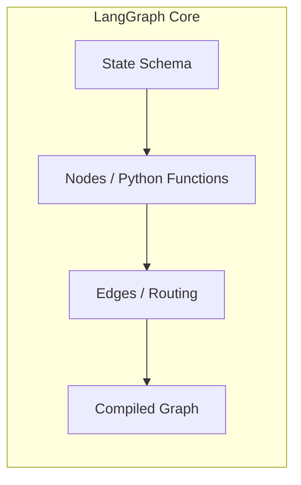
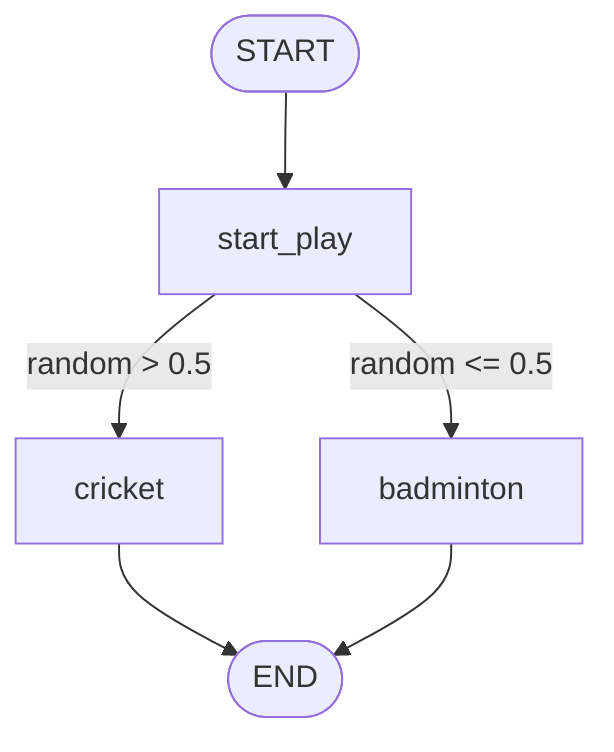
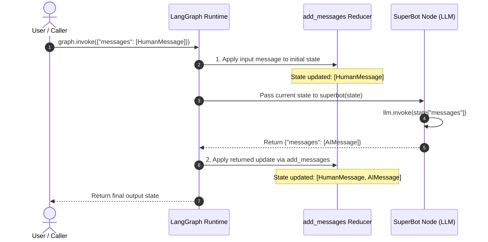
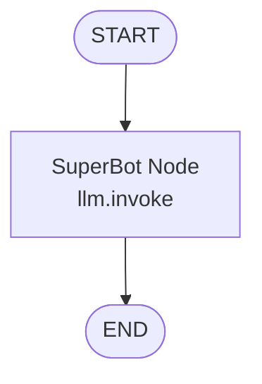
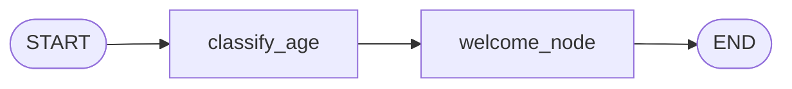
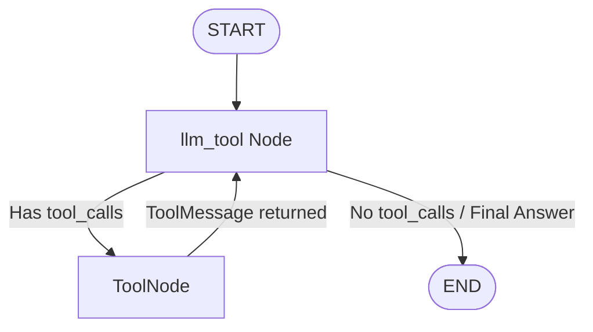

# LangGraph Fundamentals — Comprehensive Study Notes

A complete, practical, and in-depth guide to understanding **LangGraph**, based on the core tutorial notebooks in `Langgraph_basics/`.

---

## 📑 Table of Contents
1. [Overview & Core Mental Model](#1-overview--core-mental-model)
2. [Module 1: Simple Graph Construction (`1-simplegraph.ipynb`)](#2-module-1-simple-graph-construction-1-simplegraphipynb)
   - [State Definition](#state-definition)
   - [Nodes & State Overwrite Behavior](#nodes--state-overwrite-behavior)
   - [Conditional Routing & Edges](#conditional-routing--edges)
   - [Graph Compilation & Invocation](#graph-compilation--invocation)
3. [Module 2: Conversational Chatbot & Reducers (`2-chatbot.ipynb`)](#3-module-2-conversational-chatbot--reducers-2-chatbotipynb)
   - [Why Reducers are Required](#why-reducers-are-required)
   - [The `add_messages` Reducer](#the-add_messages-reducer)
   - [When and How State Messages Get Updated (Lifecycle)](#when-and-how-state-messages-get-updated-lifecycle)
   - [Chatbot Node with LLMs (Groq & OpenAI)](#chatbot-node-with-llms-groq--openai)
   - [Streaming Modes: `updates` vs `values`](#streaming-modes-updates-vs-values)
4. [Module 3: State Schemas — `TypedDict` vs `@dataclass` (`3-DataclassStateSchema.ipynb`)](#4-module-3-state-schemas--typeddict-vs-dataclass-3-dataclassstateschemaipynb)
   - [`TypedDict` Schema & Dictionary Access](#typeddict-schema--dictionary-access)
   - [`@dataclass` Schema & Dot-Notation Access](#dataclass-schema--dot-notation-access)
   - [Input Flexibility: Dataclass Instance vs Raw Dict](#input-flexibility-dataclass-instance-vs-raw-dict)
5. [Module 4: Runtime Validation with Pydantic (`4-pydantic.ipynb`)](#5-module-4-runtime-validation-with-pydantic-4-pydanticipynb)
   - [Why Use Pydantic `BaseModel`?](#why-use-pydantic-basemodel)
   - [Field Validation & Constraints](#field-validation--constraints)
   - [Automatic Type Coercion](#automatic-type-coercion)
   - [Catching Runtime `ValidationError`](#catching-runtime-validationerror)
6. [Module 5: Tool Calling & ReAct Cycles (`5-ChainsLangGraph.ipynb`)](#6-module-5-tool-calling--react-cycles-5-chainslanggraphipynb)
   - [Message Types in LangChain / LangGraph](#message-types-in-langchain--langgraph)
   - [Defining Custom Tools with `@tool`](#defining-custom-tools-with-tool)
   - [Tool Binding with `llm.bind_tools()`](#tool-binding-with-llmbind_tools)
   - [The `ToolNode` and `tools_condition` Helpers](#the-toolnode-and-tools_condition-helpers)
   - [The ReAct Graph Loop](#the-react-graph-loop)
7. [Module 6: Multi-Tool Assistants & Community Integrations (`6-chatbotswithmultipletools.ipynb`)](#7-module-6-multi-tool-assistants--community-integrations-6-chatbotswithmultipletoolsipynb)
   - [Integrating Community Tools (Arxiv & Wikipedia)](#integrating-community-tools-arxiv--wikipedia)
   - [Custom Safe Computation Tools](#custom-safe-computation-tools)
   - [Building the Multi-Tool Agent](#building-the-multi-tool-agent)
   - [Prebuilt Agent Shortcut: `create_react_agent`](#prebuilt-agent-shortcut-create_react_agent)
8. [Summary & Architectural Comparison Cheat Sheet](#8-summary--architectural-comparison-cheat-sheet)

---

## 1. Overview & Core Mental Model

**LangGraph** is a library built on top of LangChain for creating stateful, multi-actor applications with LLMs. Unlike traditional linear chains (DAGs), LangGraph allows:
- **Cycles and Loops**: Iterative agent reasoning loops (e.g., ReAct, reflection, correction).
- **State Persistence**: Centralized state that flows between nodes and is updated deterministically.
- **Fine-Grained Flow Control**: Dynamic branching and conditional routing.
- **Human-in-the-Loop & Streaming**: Pausing, inspecting, resuming execution, and streaming intermediate states.

### Core Building Blocks:


| Concept | Description |
| :--- | :--- |
| **State** | The shared memory/data structure passed to and updated by all nodes. |
| **Nodes** | Standard Python functions (`def node(state) -> dict`) that perform work and return state updates. |
| **Edges** | Define the execution path. Can be static (`add_edge`) or dynamic (`add_conditional_edges`). |
| **START / END** | Built-in sentinel nodes representing graph entry and termination points. |
| **Compile** | Validates the graph topology and produces a runnable `CompiledGraph`. |

---

## 2. Module 1: Simple Graph Construction (`1-simplegraph.ipynb`)

This notebook demonstrates the most fundamental LangGraph workflow: state creation, node definitions, conditional routing, graph compilation, and execution.

### State Definition
State is defined using `TypedDict` from Python's standard `typing` module:

```python
from typing import TypedDict

class State(TypedDict):
    graph_info: str
```

### Nodes & State Overwrite Behavior
Nodes are standard Python functions that accept the state as their first parameter and return a dictionary with key-value pairs to update in the state.

> [!NOTE]
> By default, if no reducer is specified, returned dictionary keys **overwrite** the previous state value.

```python
def start_play(state: State) -> dict:
    print("--- start_play node has been called ---")
    return {"graph_info": state['graph_info'] + " I am planning to play"}

def cricket(state: State) -> dict:
    print("--- cricket node has been called ---")
    return {"graph_info": state['graph_info'] + " Cricket"}

def badminton(state: State) -> dict:
    print("--- badminton node has been called ---")
    return {"graph_info": state['graph_info'] + " Badminton"}
```

### Conditional Routing & Edges
A router function evaluates the state and returns a `Literal` string matching the target node name:

```python
import random
from typing import Literal

def random_play(state: State) -> Literal['cricket', 'badminton']:
    if random.random() > 0.5:
        return "cricket"
    else:
        return "badminton"
```

### Graph Assembly, Compilation & Invocation



```python
from langgraph.graph import StateGraph, START, END

# 1. Initialize graph with state schema
builder = StateGraph(State)

# 2. Add nodes
builder.add_node("start_play", start_play)
builder.add_node("cricket", cricket)
builder.add_node("badminton", badminton)

# 3. Add static and conditional edges
builder.add_edge(START, "start_play")
builder.add_conditional_edges("start_play", random_play)
builder.add_edge("cricket", END)
builder.add_edge("badminton", END)

# 4. Compile the graph
graph = builder.compile()

# 5. Invoke with initial input
result = graph.invoke({"graph_info": "Hey My name is Krish"})
print(result)
# Output: {'graph_info': 'Hey My name is Krish I am planning to play Cricket'}
```

---

## 3. Module 2: Conversational Chatbot & Reducers (`2-chatbot.ipynb`)

This notebook addresses the challenge of handling conversational memory and streaming responses.

### Why Reducers are Required
In a multi-turn chat, we cannot overwrite the `messages` list with only the latest reply—we need to **append** new messages to maintain the entire chat history.

### The `add_messages` Reducer
LangGraph provides `add_messages` as an annotated reducer. It handles:
- Appending new messages to the existing list.
- Deduplication and updating messages based on unique `id`.
- Type coercion from dictionaries to Message objects.

```python
from typing import Annotated
from typing_extensions import TypedDict
from langchain_core.messages import AnyMessage, HumanMessage
from langgraph.graph.message import add_messages

class State(TypedDict):
    # Annotated[type, reducer_function]
    messages: Annotated[list[AnyMessage], add_messages]
```

### When and How State Messages Get Updated (Lifecycle)

In `2-chatbot.ipynb`, the conversation state (`state["messages"]`) is updated at **two precise points** during execution:

1. **Point 1: Graph Entry / Invocation (Input Injection)**
   - **Trigger:** Calling `graph.invoke({"messages": [input_message]})` or `graph.stream({"messages": [...]})`.
   - **Mechanism:** LangGraph initializes the graph state by passing the input dictionary through the `add_messages` reducer.
   - **State snapshot:** `messages = [HumanMessage("...")]` (Length: 1).

2. **Point 2: Node Execution Return (`superbot` Node)**
   - **Trigger:** When the `superbot` function returns `{"messages": [AIMessage(...)]}`.
   - **Mechanism:** LangGraph captures the returned dictionary and applies the reducer `add_messages(existing_messages, new_messages)`. Instead of overwriting the previous `HumanMessage`, it **appends** the new `AIMessage`.
   - **State snapshot:** `messages = [HumanMessage("..."), AIMessage("...")]` (Length: 2).

#### Visualizing the State Update Sequence



### Chatbot Node with LLMs (Groq & OpenAI)

```python
import os
from dotenv import load_dotenv
from langchain_groq import ChatGroq

load_dotenv()

# Initialize LLM (e.g. Groq Llama-3.3-70b or OpenAI gpt-4o-mini)
llm = ChatGroq(model="llama-3.3-70b-versatile")

# Chatbot node passes all messages to LLM and returns the response in a list
def superbot(state: State) -> dict:
    return {"messages": [llm.invoke(state["messages"])]}
```



```python
from langgraph.graph import StateGraph, START, END

builder = StateGraph(State)
builder.add_node("SuperBot", superbot)
builder.add_edge(START, "SuperBot")
builder.add_edge("SuperBot", END)
graph = builder.compile()

output = graph.invoke({"messages": [HumanMessage(content="Hi, My name is Krish and I like cricket")]})
```

### Streaming Modes: `updates` vs `values`

LangGraph supports different streaming granularities via `graph.stream()`:

1. **`stream_mode="updates"`**: Emits updates generated by each node as they finish executing.
   ```python
   for event in graph.stream(
       {"messages": [HumanMessage(content="Give 3 tips for cricket batting")]},
       stream_mode="updates"
   ):
       print(event)
       # Output format: {'SuperBot': {'messages': [AIMessage(...)]}}
   ```

2. **`stream_mode="values"`**: Emits the full, consolidated state snapshot after each step.
   ```python
   for state_snapshot in graph.stream(
       {"messages": [HumanMessage(content="Tell me a quick fact")]},
       stream_mode="values"
   ):
       print(f"Total messages in state: {len(state_snapshot['messages'])}")
   ```

---

## 4. Module 3: State Schemas — `TypedDict` vs `@dataclass` (`3-DataclassStateSchema.ipynb`)

LangGraph supports multiple ways to declare state schemas depending on coding preference and architecture.

### `TypedDict` Schema & Dictionary Access
- Uses standard dictionaries.
- Static typing support with mypy/IDEs.
- Key-based indexing: `state["field"]`.

```python
from typing import TypedDict, Literal, Optional

class TypedDictState(TypedDict):
    name: str
    game: Optional[Literal["cricket", "badminton"]]

def play_game(state: TypedDictState) -> dict:
    return {"name": state['name'] + " wants to play"}
```

### `@dataclass` Schema & Dot-Notation Access
- Object-oriented representation.
- Attribute access using dot-notation: `state.name`.
- Built-in default values (`game: Optional[...] = None`).

```python
from dataclasses import dataclass
from typing import Literal, Optional

@dataclass
class DataClassState:
    name: str
    game: Optional[Literal["badminton", "cricket"]] = None

def play_game_dc(state: DataClassState) -> dict:
    # Notice state.name instead of state['name']
    return {"name": state.name + " wants to play"}

def cricket_dc(state: DataClassState) -> dict:
    return {"name": state.name + " cricket", "game": "cricket"}
```

### Input Flexibility: Dataclass Instance vs Raw Dict
When using `@dataclass`, LangGraph is flexible with inputs:
```python
builder_dc = StateGraph(DataClassState)
# ... add nodes and edges ...
graph_dc = builder_dc.compile()

# Option A: Passing a dataclass instance
res_a = graph_dc.invoke(DataClassState(name="Krish"))

# Option B: Passing a standard dict (LangGraph instantiates the dataclass automatically)
res_b = graph_dc.invoke({"name": "Krish"})
```

---

## 5. Module 4: Runtime Validation with Pydantic (`4-pydantic.ipynb`)

While `TypedDict` and `@dataclass` offer structural type hints, they do not enforce runtime data validation. Using `pydantic.BaseModel` introduces strict schema enforcement.

### Why Use Pydantic `BaseModel`?
1. **Runtime Type Enforcement**: Guarantees that data entering and flowing through the graph strictly matches defined types.
2. **Field Constraints**: Supports validations such as `ge=0` (greater than or equal to 0), regex patterns, min/max lengths.
3. **Automatic Type Coercion**: Converts compatible types (e.g. string `"25"` into integer `25`).
4. **Immediate Failures**: Throws clear `pydantic.ValidationError` when contract is violated.

### Defining Pydantic State

```python
from pydantic import BaseModel, Field, ValidationError
from typing import Literal, Optional

class UserState(BaseModel):
    name: str = Field(description="Name of the user")
    age: int = Field(default=0, ge=0, description="Age in years (must be non-negative)")
    category: Optional[Literal["Junior", "Adult", "Senior"]] = None
```

### Nodes Accessing Pydantic State

```python
def classify_age(state: UserState) -> dict:
    # State fields accessed via dot notation
    if state.age < 18:
        category = "Junior"
    elif state.age < 60:
        category = "Adult"
    else:
        category = "Senior"
    return {"category": category}

def welcome_node(state: UserState) -> dict:
    return {"name": f"Welcome {state.name} ({state.category})!"}
```



### Validation In Action:
```python
builder = StateGraph(UserState)
builder.add_node("classify_age", classify_age)
builder.add_node("welcome_node", welcome_node)
builder.add_edge(START, "classify_age")
builder.add_edge("classify_age", "welcome_node")
builder.add_edge("welcome_node", END)
graph = builder.compile()

# 1. Valid Input
graph.invoke({"name": "Krish", "age": 30})
# Output: {'name': 'Welcome Krish (Adult)!', 'age': 30, 'category': 'Adult'}

# 2. Automatic Type Coercion (String "25" -> Int 25)
graph.invoke({"name": "Shivansh", "age": "25"})
# Output: {'name': 'Welcome Shivansh (Adult)!', 'age': 25, 'category': 'Adult'}

# 3. Runtime ValidationError (Invalid string for int or negative number)
try:
    graph.invoke({"name": "Krish", "age": "invalid_number"})
except ValidationError as e:
    print("Caught ValidationError:", e)
```

---

## 6. Module 5: Tool Calling & ReAct Cycles (`5-ChainsLangGraph.ipynb`)

This notebook demonstrates integrating external tools with LLMs into an autonomous **Reason + Act (ReAct)** loop.

### Message Types in LangChain / LangGraph
- `HumanMessage`: User query or input.
- `AIMessage`: Output from the LLM (may include `tool_calls`).
- `ToolMessage`: Output payload returned after executing a tool.
- `SystemMessage`: Instructions setting the behavior or persona.

### Defining Custom Tools with `@tool`
Tools are defined with clear type hints and docstrings (which become the schema sent to the LLM):

```python
from langchain_core.tools import tool

@tool
def add(a: int, b: int) -> int:
    """Add two integers a and b."""
    return a + b

@tool
def multiply(a: int, b: int) -> int:
    """Multiply two integers a and b."""
    return a * b

tools = [add, multiply]
```

### Tool Binding with `llm.bind_tools()`
Binding tools attaches the tool signatures to the LLM model invocation:

```python
from langchain_groq import ChatGroq

llm = ChatGroq(model="llama-3.3-70b-versatile")
llm_with_tools = llm.bind_tools(tools)
```

### The ReAct Architecture with `ToolNode` & `tools_condition`



- **`ToolNode(tools)`**: A built-in node that takes the latest `AIMessage`, executes any requested tool calls in parallel or sequence, and appends `ToolMessage` results to state.
- **`tools_condition`**: A built-in conditional routing function that checks if `state["messages"][-1]` contains `tool_calls`. If yes, routes to `"tools"`; otherwise, routes to `END`.

```python
from typing import Annotated
from typing_extensions import TypedDict
from langchain_core.messages import AnyMessage, HumanMessage
from langgraph.graph import StateGraph, START, END
from langgraph.graph.message import add_messages
from langgraph.prebuilt import ToolNode, tools_condition

class State(TypedDict):
    messages: Annotated[list[AnyMessage], add_messages]

def llm_tool(state: State) -> dict:
    return {"messages": [llm_with_tools.invoke(state["messages"])]}

builder = StateGraph(State)

builder.add_node("llm_tool", llm_tool)
builder.add_node("tools", ToolNode(tools))

builder.add_edge(START, "llm_tool")
builder.add_conditional_edges("llm_tool", tools_condition)
builder.add_edge("tools", "llm_tool")  # Loop back to synthesize final response!

graph = builder.compile()
```

### Execution Walkthrough
When asking `"What is 2 plus 2?"`:
1. `START` $\rightarrow$ `llm_tool`: LLM inspects prompt, generates `AIMessage` with `tool_calls=[{'name': 'add', 'args': {'a': 2, 'b': 2}}]`.
2. `tools_condition`: Detects tool call $\rightarrow$ routes to `tools`.
3. `ToolNode`: Runs `add(a=2, b=2)` $\rightarrow$ appends `ToolMessage(content='4')`.
4. `tools` $\rightarrow$ `llm_tool`: LLM reads history (User Question + Tool Request + Tool Result) and generates final `AIMessage(content="2 plus 2 is 4.")`.
5. `tools_condition`: No further tool calls $\rightarrow$ routes to `END`.

---

## 7. Module 6: Multi-Tool Assistants & Community Integrations (`6-chatbotswithmultipletools.ipynb`)

This notebook expands the ReAct agent to work across multiple third-party knowledge providers (Arxiv, Wikipedia) and custom safe calculation engines.

### Integrating Community Tools (Arxiv & Wikipedia)

```python
from langchain_community.tools import ArxivQueryRun, WikipediaQueryRun
from langchain_community.utilities import WikipediaAPIWrapper, ArxivAPIWrapper
from langchain_core.tools import tool

# 1. Arxiv API Wrapper & Tool (scientific paper retrieval)
api_wrapper_arxiv = ArxivAPIWrapper(top_k_results=2, doc_content_chars_max=500)
arxiv = ArxivQueryRun(api_wrapper=api_wrapper_arxiv)

# 2. Wikipedia API Wrapper & Tool (general encyclopedia knowledge)
api_wrapper_wiki = WikipediaAPIWrapper(top_k_results=1, doc_content_chars_max=500)
wiki = WikipediaQueryRun(api_wrapper=api_wrapper_wiki)
```

### Custom Safe Computation Tools

```python
@tool
def calculate_expression(expression: str) -> str:
    """Safely evaluates a basic mathematical expression string like '2 + 2' or '10 * 5'."""
    try:
        allowed_names = {"__builtins__": None}
        return str(eval(expression, allowed_names, {}))
    except Exception as e:
        return f"Error evaluating expression: {e}"

tools = [arxiv, wiki, calculate_expression]
```

### Complete Multi-Tool ReAct Graph

```mermaid
graph TD
    START([START]) --> tool_calling_llm[tool_calling_llm]
    tool_calling_llm -->|tools_condition| tools[ToolNode:\nArxiv | Wikipedia | Calculator]
    tools --> tool_calling_llm
    tool_calling_llm -->|No tool calls| END([END])
```

```python
from typing import Annotated
from typing_extensions import TypedDict
from langchain_core.messages import AnyMessage, HumanMessage
from langgraph.graph import StateGraph, START, END
from langgraph.graph.message import add_messages
from langgraph.prebuilt import ToolNode, tools_condition
from langchain_groq import ChatGroq

llm = ChatGroq(model="llama-3.3-70b-versatile")
llm_with_tools = llm.bind_tools(tools)

class State(TypedDict):
    messages: Annotated[list[AnyMessage], add_messages]

def tool_calling_llm(state: State) -> dict:
    return {"messages": [llm_with_tools.invoke(state["messages"])]}

builder = StateGraph(State)
builder.add_node("tool_calling_llm", tool_calling_llm)
builder.add_node("tools", ToolNode(tools))

builder.add_edge(START, "tool_calling_llm")
builder.add_conditional_edges("tool_calling_llm", tools_condition)
builder.add_edge("tools", "tool_calling_llm")

graph = builder.compile()
```

### Prebuilt Agent Shortcut: `create_react_agent`
For standard ReAct workflows that do not require custom routing or intermediate state transformations, LangGraph provides a high-level one-liner:

```python
from langgraph.prebuilt import create_react_agent

prebuilt_agent = create_react_agent(llm, tools)
response = prebuilt_agent.invoke({"messages": [HumanMessage(content="Summarize paper 1706.03762")]})
```

---

## 8. Summary & Architectural Comparison Cheat Sheet

### State Schema Options Comparison

| Feature | `TypedDict` | `@dataclass` | `Pydantic BaseModel` |
| :--- | :--- | :--- | :--- |
| **Data Structure** | Python Dictionary (`dict`) | Python Class Object | Pydantic Model Object |
| **Field Access** | `state["key"]` | `state.key` | `state.key` |
| **Static Typing** | ✅ Hints for IDE/mypy | ✅ Type annotations | ✅ Type annotations |
| **Runtime Validation** | ❌ None | ❌ None | ✅ Strict runtime validation |
| **Type Coercion** | ❌ None | ❌ None | ✅ Coerces compatible types |
| **Default Values** | ⚠️ Limited | ✅ Supported | ✅ Supported with `Field()` |
| **Best Use Case** | Simple graphs, message lists | Clean Python OOP syntax | Production APIs & validated state |

---

### Core LangGraph API Quick Reference

| Class / Function | Module | Description |
| :--- | :--- | :--- |
| `StateGraph(Schema)` | `langgraph.graph` | Central graph builder initialized with a state schema. |
| `START` / `END` | `langgraph.graph` | Virtual entrypoint and exit point nodes. |
| `builder.add_node(name, func)` | `langgraph.graph` | Registers a node function. |
| `builder.add_edge(source, target)` | `langgraph.graph` | Adds a deterministic directional edge. |
| `builder.add_conditional_edges(source, router_func)` | `langgraph.graph` | Adds dynamic branching based on router output. |
| `builder.compile()` | `langgraph.graph` | Validates topology and compiles to a `CompiledGraph`. |
| `add_messages` | `langgraph.graph.message` | Reducer function that appends/updates conversation messages. |
| `ToolNode(tools)` | `langgraph.prebuilt` | Node that executes tool calls from the latest `AIMessage`. |
| `tools_condition` | `langgraph.prebuilt` | Router that directs to `"tools"` if tool calls exist, else `END`. |
| `create_react_agent(llm, tools)` | `langgraph.prebuilt` | High-level constructor for a prebuilt ReAct agent. |
| `graph.invoke(input_dict)` | `langgraph.graph` | Runs the graph synchronously to completion. |
| `graph.stream(input_dict, stream_mode=...)` | `langgraph.graph` | Streams intermediate outputs (`updates` or `values`). |
| `graph.get_graph().draw_mermaid_png()` | `langgraph.graph` | Generates a visual Mermaid PNG diagram of the graph. |
